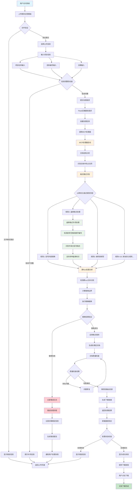

# 商务应答系统流程图

## 系统概述

商务应答系统是一个智能文档处理平台，支持自动填充公司信息、项目信息匹配和文档生成功能。系统采用MCP (Model Context Protocol) 处理架构，支持10种优化格式规则和跨run处理技术，具备完善的盖章格式识别能力。

## 系统流程图

## 流程模块说明

### 1. 用户界面操作模块
- **文件上传验证**：检查上传文件的格式和完整性
- **公司信息选择**：从预设的公司配置中选择
- **项目信息输入**：包括项目名称、招标编号、日期等关键信息
- **信息完整性检查**：确保所有必填字段都已填写

### 2. 后端处理逻辑模块
- **Flask接收处理请求**：Web框架接收前端提交的处理任务
- **创建处理任务**：初始化文档处理流程
- **调用MCP处理器**：启动核心处理引擎

### 3. MCP处理器核心功能
- **文档结构分析**：解析Word文档的内部结构
- **占位符识别**：自动识别需要填写的位置
- **10种优化格式规则**：经过合并优化的高效处理规则
  - 规则1: 通用括号内容替换（公司名称类）
  - 规则2: **盖章格式专项处理**（支持前导空格、数字编号、中英文括号）
  - 规则3: 编号类统一填写（采购编号、项目编号等）
  - 规则4-10: 其他优化处理规则
- **盖章格式专项处理**：
  - 支持前导空格和制表符（如"    公司名称（全称、盖章）："）
  - 支持数字编号前缀（如"1. 公司名称（盖章）："）
  - 支持中英文括号混用（如"供应商名称（盖章）"和"供应商名称(盖章)"）
  - 识别多种盖章标识（盖章、公章、全称盖章等）
- **跨run处理分析**：处理Word文档中跨run的文本分割问题
- **精确替换**：通过边界计算确保替换的准确性
- **格式保持**：维持原文档的格式和样式

### 4. 错误处理机制
- **文件验证错误**：处理文件格式不正确的情况
- **信息不完整提示**：引导用户补充必要信息
- **处理失败记录**：详细记录错误信息用于调试
- **错误报告生成**：为用户和开发者提供错误详情

### 5. 结果输出模块
- **文档生成和保存**：创建填写完成的文档文件
- **质量检查**：验证处理结果的正确性
- **下载链接提供**：为用户提供安全的下载通道
- **用户下载完成**：完成整个处理流程

## 技术特点

1. **高精度处理**：通过MCP处理器实现高精度的文档内容识别和替换
2. **优化格式支持**：从27规则优化至10规则，提高处理效率同时保持完整功能
3. **盖章格式专项优化**：
   - 完美支持"公司名称（全称、盖章）"等复杂格式
   - 自适应前导空格、数字编号、制表符等各种缩进格式
   - 兼容中英文括号和多种盖章标识
4. **跨run处理**：解决Word文档技术难题，确保处理的完整性
5. **错误恢复**：完善的错误处理和恢复机制
6. **用户友好**：简洁的界面操作和清晰的状态反馈

## 系统优势

- **自动化程度高**：减少手工填写工作量
- **处理准确性好**：通过先进算法确保填写正确性
- **适应性强**：支持多种文档格式和模板
- **易于维护**：模块化设计便于功能扩展和维护
- **盖章格式专业**：专门优化中国商务文档常见的盖章格式处理

## 最新更新记录

### v2.0 - 2025年9月7日
- **规则优化**：将处理规则从27个优化至10个，提高处理效率
- **盖章格式专项修复**：完美解决"公司名称（全称、盖章）"等格式问题
- **前导空格支持**：支持各种前导空格、制表符和数字编号格式
- **括号兼容性**：同时支持中文括号（）和英文括号()
- **流程图更新**：更新系统流程图反映最新的处理架构

### 技术改进亮点
- 修复正则表达式：`^(?:\s*\d+\.\s*|\s+)?` 支持前导空格
- 增强格式识别：支持"供应商名称（盖章）"、"投标人名称（盖章）"等
- 保持格式一致：处理后保持原文档的缩进和格式
- 测试验证完善：通过多重测试确保修复效果