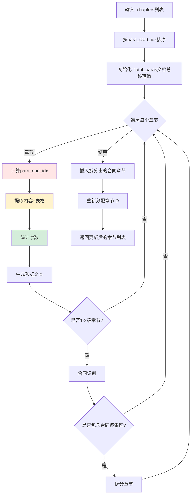

# 📍 `_locate_chapter_content()` 函数详细解析

## 函数职责

这是**字数统计的核心函数**，负责：
1. ✅ 计算每个章节的结束位置 (`para_end_idx`)
2. ✅ 提取章节内容（段落+表格）
3. ✅ 统计字数 (`word_count`)
4. ✅ 生成预览文本 (`preview_text`)
5. ✅ 识别并拆分合同章节（额外功能）

**位置**: `structure_parser.py:2370-2527`

---

## 执行流程图



---

## 详细步骤解析

### 步骤0: 排序章节 (2381-2384行)

```python
# ⭐ 关键: 按段落索引排序
chapters_sorted = sorted(chapters, key=lambda ch: ch.para_start_idx)
```

**为什么要排序？**

假设解析器识别到的章节顺序是乱的：
```
章节A: para_start_idx = 100
章节B: para_start_idx = 20   ← 实际在前面
章节C: para_start_idx = 50
```

排序后确保顺序与文档物理顺序一致：
```
章节B: para_start_idx = 20
章节C: para_start_idx = 50
章节A: para_start_idx = 100
```

---

### 步骤1: 计算章节结束位置 `para_end_idx` ⭐⭐⭐

**代码**: 2391-2400行

```python
for i, chapter in enumerate(chapters_sorted):
    # 默认到文档末尾
    next_start = total_paras

    # 查找下一个同级或更高级标题
    for j in range(i + 1, len(chapters_sorted)):
        if chapters_sorted[j].level <= chapter.level:
            next_start = chapters_sorted[j].para_start_idx
            break

    chapter.para_end_idx = next_start - 1
```

**逻辑解析**:

#### 示例1: 平级章节

```
文档结构:
段落15: "第一章 项目概述"  ← 章节A (level=1, para_start=15)
段落16: "本项目位于..."
段落17: "总投资额..."
段落25: "第二章 技术要求"  ← 章节B (level=1, para_start=25)
段落26: "技术指标..."

计算过程:
i=0, 章节A:
  - 遍历后续章节,找到章节B (level=1 ≤ 1)
  - next_start = 25
  - para_end_idx = 25 - 1 = 24

结果:
章节A范围: [15, 24]  ✅ 包含段落16-24
章节B范围: [25, 文档末尾]
```

#### 示例2: 嵌套章节

```
文档结构:
段落10: "第一章 项目概述"      ← 章节A (level=1, para_start=10)
段落11: "1.1 项目背景"         ← 章节A1 (level=2, para_start=11)
段落12: "背景描述..."
段落15: "1.2 项目目标"         ← 章节A2 (level=2, para_start=15)
段落16: "目标说明..."
段落20: "第二章 技术要求"      ← 章节B (level=1, para_start=20)

计算过程:
i=0, 章节A (level=1):
  - 遍历后续章节
  - 跳过章节A1 (level=2 > 1)
  - 跳过章节A2 (level=2 > 1)
  - 找到章节B (level=1 ≤ 1)
  - next_start = 20
  - para_end_idx = 19

i=1, 章节A1 (level=2):
  - 找到章节A2 (level=2 ≤ 2)
  - next_start = 15
  - para_end_idx = 14

i=2, 章节A2 (level=2):
  - 找到章节B (level=1 ≤ 2)  ← 上级章节也算
  - next_start = 20
  - para_end_idx = 19

结果:
章节A范围:  [10, 19]
章节A1范围: [11, 14]
章节A2范围: [15, 19]
章节B范围:  [20, 末尾]
```

**这个逻辑的问题** ⚠️:

```
问题场景:
段落100: "第一章 项目概述"  ← para_start=100
段落101: "内容..."
段落102: ""                ← 空段落
段落103: ""                ← 空段落
段落104: "第二章 技术要求"  ← para_start=104

当前计算:
para_end_idx = 104 - 1 = 103  ← 包含了空段落

实际内容:
doc.paragraphs[101:104] = ["内容...", "", ""]

字数统计:
word_count = len("内容...".replace(' ', '').replace('\n', ''))
# 空段落不影响字数,但边界不精确
```

---

### 步骤2: 提取章节内容 (2402-2405行)

```python
content_text, preview_text = self._extract_chapter_content_with_tables(
    doc, chapter.para_start_idx, chapter.para_end_idx
)
```

**调用的函数**: `_extract_chapter_content_with_tables()` (后面详细讲)

**返回值**:
- `content_text`: 完整内容文本（段落+表格）
- `preview_text`: 前5行预览文本

---

### 步骤3: 统计字数 ⭐⭐⭐ (2408行)

```python
chapter.word_count = len(content_text.replace(' ', '').replace('\n', ''))
```

**统计逻辑**:

```python
示例1: 纯文字
content_text = "第一章 项目概述\n本项目位于北京市朝阳区。"
去除空格换行 = "第一章项目概述本项目位于北京市朝阳区。"
word_count = len("第一章项目概述本项目位于北京市朝阳区。") = 19

示例2: 包含表格
content_text = """
项目名称: AI招标系统
预算金额: 100万元
[表格]
序号 | 设备名称 | 数量
1 | 服务器 | 10台
2 | 交换机 | 5台
"""
去除空格换行 = "项目名称:AI招标系统预算金额:100万元[表格]序号|设备名称|数量1|服务器|10台2|交换机|5台"
word_count = 字符数

示例3: 中英文混合
content_text = "Hello World 你好世界"
去除空格换行 = "HelloWorld你好世界"
word_count = len("HelloWorld你好世界") = 14
# 注意: Word可能统计为 2个英文单词 + 4个中文字符 = 6
```

**这就是与Word差异的根源！** ⚠️

---

### 步骤4: 生成预览文本 (2409行)

```python
chapter.preview_text = preview_text if preview_text else "(无内容)"
```

预览文本由 `_extract_chapter_content_with_tables()` 生成,包含前5行内容。

---

### 步骤5-8: 合同识别与章节拆分 (2411-2511行)

**额外功能**,用于智能识别合同条款章节并拆分。

#### 示例场景:

```
原始章节:
段落100-150: "第三章 商务要求"
  - 段落100-120: 正常商务要求(付款方式、交付时间...)
  - 段落121-150: 合同条款聚集区(甲方乙方、违约责任...)

拆分后:
章节1: "第三章 商务要求" [100-120]  ← 保留,auto_selected=True
章节2: "[检测到的合同条款-需人工确认]" [121-150]  ← 新建,skip_recommended=True
```

**判断逻辑**:
- 检测关键词密度 (甲方、乙方、违约、赔偿...)
- 前半部分至少1000字
- 至少跳过5个段落

---

## `_extract_chapter_content_with_tables()` 详解

这是**实际提取内容和统计字数**的函数。

### 函数签名

```python
def _extract_chapter_content_with_tables(
    self,
    doc: Document,
    para_start_idx: int,
    para_end_idx: int
) -> tuple:
    """
    Returns:
        (完整内容文本, 预览文本)
    """
```

### 核心逻辑流程图

```mermaid
flowchart TD
    Start[输入: para_start_idx, para_end_idx] --> Map[构建段落索引→body元素映射]

    Map --> Find[定位start_body_idx和end_body_idx]

    Find --> Loop{遍历body元素}

    Loop -->|CT_P 段落| ExtractPara[提取段落文本]
    Loop -->|CT_Tbl 表格| ExtractTable[提取表格文本]

    ExtractPara --> AddContent[添加到content_parts]
    ExtractTable --> AddTableContent[添加到content_parts<br/>格式: [表格]\n行1\n行2...]

    AddContent --> CheckPreview{预览行数<5?}
    AddTableContent --> CheckPreview

    CheckPreview -->|是| AddPreview[添加到preview_lines]
    CheckPreview -->|否| Loop

    AddPreview --> Loop

    Loop -->|结束| Merge[合并所有内容]
    Merge --> Return[返回 full_content, preview_text]

    style ExtractTable fill:#fff3cd
    style AddTableContent fill:#ffe6e6
```

### 详细代码分析

#### 阶段1: 定位body元素范围 (2541-2559行)

**为什么需要这一步？**

Word文档的 `doc.paragraphs` 只包含段落,不包含表格。
但文档的 `doc.element.body` 包含所有元素(段落+表格),顺序与文档一致。

```python
# 构建映射: 段落索引 → body元素索引
para_count = 0
start_body_idx = None
end_body_idx = None

for body_idx, element in enumerate(doc.element.body):
    if isinstance(element, CT_P):  # 段落
        if para_count == para_start_idx:
            start_body_idx = body_idx
        if para_count == para_end_idx:
            end_body_idx = body_idx
            break
        para_count += 1
```

**示例**:

```
doc.element.body:
[0] CT_P  → 段落0 "文档标题"
[1] CT_P  → 段落1 "第一章 概述"
[2] CT_P  → 段落2 "本项目..."
[3] CT_Tbl → 表格1 (不计入paragraphs)
[4] CT_P  → 段落3 "技术要求..."
[5] CT_Tbl → 表格2
[6] CT_P  → 段落4 "第二章 商务"

假设章节范围: para_start=1, para_end=3

映射过程:
body_idx=0, para_count=0
body_idx=1, para_count=1  ← para_count == para_start → start_body_idx=1
body_idx=2, para_count=2
body_idx=3, (表格,跳过)
body_idx=4, para_count=3  ← para_count == para_end → end_body_idx=4

结果:
start_body_idx=1, end_body_idx=4
实际提取: body[2:5] = [段落2, 表格1, 段落3]  ← 包含表格！
```

#### 阶段2: 提取段落 (2566-2578行)

```python
for body_idx in range(start_body_idx + 1, end_body_idx + 1):
    element = doc.element.body[body_idx]

    if isinstance(element, CT_P):
        para = Paragraph(element, doc)
        text = para.text.strip()
        if text:
            content_parts.append(text)
            # 添加到预览
            if len(preview_lines) < 5:
                preview_lines.append(text[:100] + ('...' if len(text) > 100 else ''))
```

**为什么 `start_body_idx + 1`？**

跳过章节标题本身,只提取内容。

```
body[1]: "第一章 项目概述"  ← 标题,跳过
body[2]: "本项目位于..."    ← 从这里开始提取
```

#### 阶段3: 提取表格 ⭐⭐⭐ (2580-2611行)

```python
elif isinstance(element, CT_Tbl):
    table = Table(element, doc)

    # 提取表格文本
    table_text_parts = []
    for row_idx, row in enumerate(table.rows):
        row_data = []
        for cell in row.cells:
            # ⚠️ 只提取段落文本,不包括嵌套表格
            cell_text = '\n'.join(p.text.strip() for p in cell.paragraphs if p.text.strip())
            row_data.append(cell_text)

        if any(cell.strip() for cell in row_data):  # 非空行
            row_text = ' | '.join(row_data)
            table_text_parts.append(row_text)

    if table_text_parts:
        # 添加表格标识
        table_content = f"[表格]\n" + '\n'.join(table_text_parts)
        content_parts.append(table_content)
```

**提取示例**:

```
Word表格:
+--------+----------+------+
| 序号   | 设备名称 | 数量 |
+--------+----------+------+
| 1      | 服务器   | 10台 |
+--------+----------+------+
| 2      | 交换机   | 5台  |
+--------+----------+------+

提取后:
[表格]
序号 | 设备名称 | 数量
1 | 服务器 | 10台
2 | 交换机 | 5台
```

**表格字数统计**:

```python
content_text = "[表格]\n序号 | 设备名称 | 数量\n1 | 服务器 | 10台\n2 | 交换机 | 5台"
去除空格换行 = "[表格]序号|设备名称|数量1|服务器|10台2|交换机|5台"
word_count = len("[表格]序号|设备名称|数量1|服务器|10台2|交换机|5台") = 28
```

**潜在问题** ⚠️:

1. **嵌套表格未提取**
   ```python
   # 当前代码
   cell_text = '\n'.join(p.text.strip() for p in cell.paragraphs)

   # 如果cell内有嵌套表格,cell.paragraphs不包含表格文本
   # 需要递归提取: cell.tables
   ```

2. **文本框未提取**
   - 表格单元格中的文本框(Shape/TextBox)不在paragraphs中

3. **合并单元格可能重复统计**
   ```python
   # cell.text 对于合并单元格会重复返回相同内容
   # 需要检测: cell._element.gridSpan
   ```

#### 阶段4: 合并与返回 (2613-2616行)

```python
full_content = '\n'.join(content_parts)
preview_text = '\n'.join(preview_lines)

return full_content, preview_text
```

---

## 🔍 完整执行示例

假设有如下文档:

```
段落0:  "招标文件"
段落1:  ""
段落2:  "第一章 项目概述"         ← 章节A (level=1, para_start=2)
段落3:  "本项目位于北京..."
段落4:  "总投资额1000万元。"
段落5:  [表格: 项目基本信息]
段落6:  "备注: 以上信息..."
段落7:  "第二章 技术要求"         ← 章节B (level=1, para_start=7)
段落8:  "技术指标如下..."
```

### 执行流程:

#### 1. 排序
```python
chapters = [章节A, 章节B]  # 已按para_start排序
```

#### 2. 计算章节A的para_end_idx
```python
i=0, 章节A (level=1, para_start=2):
  遍历后续章节:
    j=1, 章节B (level=1 ≤ 1)  ← 找到
    next_start = 7
  para_end_idx = 7 - 1 = 6

章节A范围: [2, 6]
```

#### 3. 提取章节A内容
```python
_extract_chapter_content_with_tables(doc, para_start=2, para_end=6)

# 定位body元素
doc.element.body:
[0] CT_P  → 段落0
[1] CT_P  → 段落1
[2] CT_P  → 段落2  ← para_start=2 → start_body_idx=2
[3] CT_P  → 段落3
[4] CT_P  → 段落4
[5] CT_Tbl → 表格
[6] CT_P  → 段落6  ← para_end=6 → end_body_idx=6

# 提取内容 (body[3:7])
content_parts = [
    "本项目位于北京...",  # 段落3
    "总投资额1000万元。", # 段落4
    "[表格]\n项目名称 | XX项目\n...",  # 表格
    "备注: 以上信息..."  # 段落6
]

full_content = '\n'.join(content_parts)
```

#### 4. 统计字数
```python
word_count = len(full_content.replace(' ', '').replace('\n', ''))
# 假设去除后 = "本项目位于北京...总投资额1000万元。[表格]项目名称|XX项目...备注:以上信息..."
# word_count ≈ 50 (示例值)
```

#### 5. 更新章节对象
```python
章节A.para_end_idx = 6
章节A.word_count = 50
章节A.preview_text = "本项目位于北京...\n总投资额1000万元。\n[表格]\n..."
```

---

## ⚠️ 潜在问题总结

### 问题1: 段落边界包含空段落
**位置**: 2395-2400行
```python
# 当前
chapter.para_end_idx = next_start - 1

# 问题: 如果 next_start 前有空段落,会被包含在内
段落6: "备注..."
段落7: ""         ← 空段落
段落8: ""         ← 空段落
段落9: "第二章"   ← next_start=9
para_end_idx = 8  ← 包含了空段落7、8
```

**影响**: 字数统计不受影响(空段落strip后为空),但边界不精确。

### 问题2: 表格嵌套内容未提取
**位置**: 2592行
```python
# 当前
cell_text = '\n'.join(p.text.strip() for p in cell.paragraphs)

# 遗漏:
# - cell.tables (嵌套表格)
# - cell中的文本框/图形对象
```

**影响**: 表格内容不完整,字数偏少。

### 问题3: 字数统计方式与Word不同
**位置**: 2408行
```python
# 当前: 字符计数
word_count = len(text.replace(' ', '').replace('\n', ''))

# Word: 单词+字符计数
# 英文: 按空格分隔的单词
# 中文: 按字符
```

**影响**: 英文内容字数偏多。

---

## 💡 优化建议

### 建议1: 优化段落边界
```python
# 改进后
next_start = chapters_sorted[j].para_start_idx

# 向前查找最后一个非空段落
end_idx = next_start - 1
while end_idx > chapter.para_start_idx:
    if doc.paragraphs[end_idx].text.strip():
        break
    end_idx -= 1

chapter.para_end_idx = end_idx
```

### 建议2: 递归提取表格
```python
def _extract_cell_content(self, cell):
    """递归提取单元格内容"""
    content = []

    # 段落文本
    for para in cell.paragraphs:
        if para.text.strip():
            content.append(para.text.strip())

    # 嵌套表格
    for nested_table in cell.tables:
        nested_content = self._extract_table_content(nested_table)
        content.append(nested_content)

    return '\n'.join(content)
```

### 建议3: 提供字数统计模式
```python
def _calculate_word_count(self, text, mode='char'):
    if mode == 'char':
        return len(text.replace(' ', '').replace('\n', ''))
    elif mode == 'word':
        # 中英文混合统计
        import re
        chinese = len(re.findall(r'[\u4e00-\u9fff]', text))
        english = len(re.findall(r'\b[a-zA-Z]+\b', text))
        return chinese + english
```

---

## 总结

`_locate_chapter_content()` 函数是字数统计的核心,分3步:

1. **计算边界** (`para_end_idx`) - 找到下一个同级/上级章节
2. **提取内容** - 遍历body元素,提取段落+表格
3. **统计字数** - 去除空格换行后计数

**字数差异主要来源**:
- 段落边界可能包含空段落(影响小)
- 表格嵌套内容未提取(影响中)
- 统计方式与Word不同(影响大,特别是英文内容)

**推荐修复顺序**:
1. 改进表格提取逻辑 (支持嵌套)
2. 优化段落边界计算 (去除尾部空段落)
3. 可选: 提供多种统计模式
