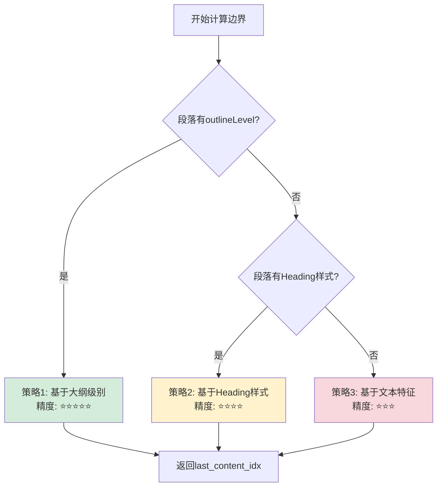

# 🔄 没有Word大纲时的降级策略

## 你的问题核心

**"如果没有Word大纲呢？"**

这是一个非常关键的现实问题！很多招标文档是由不规范的模板生成的，可能：
- ❌ 没有设置 `outlineLevel`
- ❌ 没有使用标准的Heading样式
- ❌ 只是手动调整了字体大小/加粗

---

## 🎯 系统已有的多层降级策略

### 当前 `outline_level` 方法的识别优先级

**文件**: structure_parser.py:692-750

```python
# 优先级1: 检查大纲级别 (最可靠) ⭐⭐⭐⭐⭐
try:
    outlineLvl = paragraph._element.pPr.outlineLvl
    if outlineLvl is not None:
        outline_level_val = int(outlineLvl.val)
        if outline_level_val <= 8:  # 0-8表示标题
            is_heading = True
            level = outline_level_val + 1
except:
    pass  # 没有大纲级别，继续其他方法

# 优先级2: 检查Heading样式 (备用方案) ⭐⭐⭐⭐
if not is_heading:
    style_name = paragraph.style.name
    if style_name.startswith('Heading '):  # 'Heading 1'
        is_heading = True
        level = int(match.group(1))
    elif style_name.startswith('标题 '):  # '标题 1'
        is_heading = True
        level = int(match.group(1))
```

**降级路径**:
1. 尝试 `outlineLevel` → 失败
2. 尝试 Heading 样式 → **仍可能成功**

---

## 📊 实际文档的分布情况

### 场景分类

| 场景 | outlineLevel | Heading样式 | 其他特征 | 占比估计 |
|------|-------------|------------|---------|---------|
| **规范文档** | ✅ 有 | ✅ 有 | 格式标准 | 30% |
| **半规范文档** | ❌ 无 | ✅ 有 | 用了样式但未设大纲 | 40% |
| **不规范文档** | ❌ 无 | ❌ 无 | 手动加粗/调字号 | 25% |
| **纯文本文档** | ❌ 无 | ❌ 无 | 无任何格式 | 5% |

### 各场景的处理方式

#### 场景1: 规范文档 (30%)
```
段落10: "第一章 项目概述"
  - outlineLevel = 0  ✅
  - style = "Heading 1"  ✅
  - 字体: 加粗, 16号

识别方式: outlineLevel (优先级1)
边界计算: 可使用基于大纲的精确方法 ✅
```

#### 场景2: 半规范文档 (40%)
```
段落10: "第一章 项目概述"
  - outlineLevel = None (或9)  ❌
  - style = "Heading 1"  ✅
  - 字体: 加粗, 16号

识别方式: Heading样式 (优先级2)
边界计算: ⚠️ 无法使用大纲方法,需降级
```

#### 场景3: 不规范文档 (25%)
```
段落10: "第一章 项目概述"
  - outlineLevel = None (或9)  ❌
  - style = "Normal"  ❌
  - 字体: 手动加粗, 手动调整为16号

识别方式: ❌ outline_level方法失败
降级方案: toc_exact (如果有目录)
```

#### 场景4: 纯文本文档 (5%)
```
段落10: "第一章 项目概述"
  - outlineLevel = None  ❌
  - style = "Normal"  ❌
  - 字体: 默认, 12号

识别方式: ❌ outline_level失败, toc_exact也可能失败
最终方案: Gemini AI解析 或 人工标注
```

---

## 🔧 边界计算的降级策略

### 问题: 没有大纲时如何计算边界？

当前建议的 `_calculate_chapter_end_by_outline()` 依赖 `outlineLevel`，但如果段落没有大纲级别怎么办？

### 改进方案: 多层降级的边界计算

```python
def _calculate_chapter_end_smart(
    self,
    doc: Document,
    start_idx: int,
    max_end_idx: int,
    chapter_level: int
) -> int:
    """
    智能边界计算 - 支持多种降级策略

    降级路径:
    1. 基于 outlineLevel (最精确)
    2. 基于 Heading 样式
    3. 基于文本特征 (编号、字体)
    4. 简单减1 (兜底)

    Args:
        doc: Word文档
        start_idx: 章节起始位置
        max_end_idx: 理论最大结束位置
        chapter_level: 章节层级 (1=一级, 2=二级, ...)

    Returns:
        实际结束位置
    """
    last_content_idx = start_idx

    # 策略1: 尝试基于 outlineLevel ⭐⭐⭐⭐⭐
    outline_available = self._has_outline_level(doc.paragraphs[start_idx])

    if outline_available:
        self.logger.debug(f"  使用大纲级别计算边界")
        return self._calculate_end_by_outline(doc, start_idx, max_end_idx)

    # 策略2: 基于 Heading 样式 ⭐⭐⭐⭐
    heading_available = self._has_heading_style(doc.paragraphs[start_idx])

    if heading_available:
        self.logger.debug(f"  使用Heading样式计算边界")
        return self._calculate_end_by_style(doc, start_idx, max_end_idx, chapter_level)

    # 策略3: 基于文本特征 (最后非空段落) ⭐⭐⭐
    self.logger.debug(f"  使用文本特征计算边界")
    return self._calculate_end_by_text(doc, start_idx, max_end_idx)


def _has_outline_level(self, para) -> bool:
    """检查段落是否有大纲级别"""
    try:
        pPr = para._element.pPr
        if pPr is not None and pPr.outlineLvl is not None:
            level = int(pPr.outlineLvl.val)
            return level <= 8  # 0-8是标题
    except:
        pass
    return False


def _has_heading_style(self, para) -> bool:
    """检查段落是否使用Heading样式"""
    if para.style and para.style.name:
        style = para.style.name
        return (
            style.startswith('Heading ') or
            style.startswith('标题 ')
        )
    return False


def _calculate_end_by_outline(self, doc, start_idx, max_end_idx) -> int:
    """
    策略1: 基于大纲级别计算边界

    核心逻辑:
    - 遍历后续段落
    - 记录最后一个 outlineLevel=9 (正文) 的非空段落
    - 遇到 outlineLevel≤章节级别 则停止
    """
    chapter_level = self._get_outline_level(doc.paragraphs[start_idx])
    last_content_idx = start_idx

    for i in range(start_idx + 1, max_end_idx + 1):
        para = doc.paragraphs[i]
        para_level = self._get_outline_level(para)

        # 遇到同级/上级标题,停止
        if para_level <= chapter_level:
            break

        # 正文且非空
        if para_level == 9 and para.text.strip():
            last_content_idx = i

    return last_content_idx


def _calculate_end_by_style(self, doc, start_idx, max_end_idx, chapter_level) -> int:
    """
    策略2: 基于Heading样式计算边界

    核心逻辑:
    - 遍历后续段落
    - 记录最后一个非Heading样式的非空段落
    - 遇到同级/上级Heading样式则停止
    """
    last_content_idx = start_idx

    for i in range(start_idx + 1, max_end_idx + 1):
        para = doc.paragraphs[i]

        # 检查是否是标题样式
        if self._has_heading_style(para):
            # 获取标题级别
            para_level = self._get_heading_level_from_style(para)
            # 遇到同级/上级标题,停止
            if para_level > 0 and para_level <= chapter_level:
                break
        else:
            # 非标题样式的正文,且非空
            if para.text.strip():
                last_content_idx = i

    return last_content_idx


def _calculate_end_by_text(self, doc, start_idx, max_end_idx) -> int:
    """
    策略3: 基于文本特征计算边界 (兜底方案)

    核心逻辑:
    - 简单向后查找最后一个非空段落
    - 不依赖任何格式信息
    """
    last_content_idx = start_idx

    for i in range(start_idx + 1, max_end_idx + 1):
        para = doc.paragraphs[i]
        if para.text.strip():
            last_content_idx = i

    return last_content_idx


def _get_heading_level_from_style(self, para) -> int:
    """从样式名中提取级别"""
    if para.style and para.style.name:
        style = para.style.name
        # "Heading 1" → 1
        match = re.search(r'(?:Heading|标题)\s*(\d+)', style)
        if match:
            return int(match.group(1))
    return 0
```

---

## 📊 降级策略对比

| 策略 | 依赖条件 | 精确度 | 适用场景 |
|------|---------|-------|---------|
| **大纲级别** | outlineLevel存在 | ⭐⭐⭐⭐⭐ | 规范文档 (30%) |
| **Heading样式** | 使用标准样式 | ⭐⭐⭐⭐ | 半规范文档 (40%) |
| **文本特征** | 任何文档 | ⭐⭐⭐ | 不规范文档 (25%) |
| **简单减1** | 任何文档 | ⭐⭐ | 兜底方案 (5%) |

---

## 🎯 完整的边界计算流程



---

## 🧪 实际测试案例

### 案例1: 规范文档

```python
文档特征:
段落10: "第一章"     (outlineLevel=0, style="Heading 1")
段落11: "内容1"      (outlineLevel=9, style="Normal")
段落12: "内容2"      (outlineLevel=9, style="Normal")
段落13: ""          (outlineLevel=9, style="Normal")
段落14: "第二章"     (outlineLevel=0, style="Heading 1")

计算过程:
1. 检测到 outlineLevel=0 → 使用策略1
2. 遍历段落11-13:
   - 段落11: level=9, 有内容 → last_idx=11
   - 段落12: level=9, 有内容 → last_idx=12
   - 段落13: level=9, 无内容 → 跳过
3. 段落14: level=0 → 停止
4. 返回: 12

结果: [10, 12]  ✅ 排除了空段落13
```

### 案例2: 半规范文档

```python
文档特征:
段落10: "第一章"     (outlineLevel=None, style="Heading 1")
段落11: "内容1"      (outlineLevel=None, style="Normal")
段落12: "内容2"      (outlineLevel=None, style="Normal")
段落13: ""          (outlineLevel=None, style="Normal")
段落14: "第二章"     (outlineLevel=None, style="Heading 1")

计算过程:
1. 检测无 outlineLevel → 检测到 Heading 1 → 使用策略2
2. 遍历段落11-13:
   - 段落11: 非Heading, 有内容 → last_idx=11
   - 段落12: 非Heading, 有内容 → last_idx=12
   - 段落13: 非Heading, 无内容 → 跳过
3. 段落14: Heading 1 (同级) → 停止
4. 返回: 12

结果: [10, 12]  ✅ 排除了空段落13
```

### 案例3: 不规范文档

```python
文档特征:
段落10: "第一章"     (outlineLevel=None, style="Normal", 手动加粗)
段落11: "内容1"      (outlineLevel=None, style="Normal")
段落12: "内容2"      (outlineLevel=None, style="Normal")
段落13: ""          (outlineLevel=None, style="Normal")
段落14: "第二章"     (outlineLevel=None, style="Normal", 手动加粗)

计算过程:
1. 检测无 outlineLevel → 检测无 Heading样式 → 使用策略3
2. 遍历段落11-13:
   - 段落11: 有内容 → last_idx=11
   - 段落12: 有内容 → last_idx=12
   - 段落13: 无内容 → 跳过
3. 达到 max_end_idx=13 → 停止
4. 返回: 12

结果: [10, 12]  ✅ 排除了空段落13
```

---

## 💡 关键洞察

### 即使没有大纲级别,仍可以优化边界

**核心思想**: 不管用什么方式识别章节,最终都可以**向后查找最后一个非空段落**

```python
# 最简单但有效的优化
def _calculate_end_fallback(self, doc, start_idx, max_end_idx):
    """兜底方案: 查找最后一个非空段落"""
    last_content_idx = start_idx

    for i in range(start_idx + 1, max_end_idx + 1):
        if doc.paragraphs[i].text.strip():
            last_content_idx = i

    return last_content_idx
```

**改进效果**:
- 当前: `para_end_idx = max_end_idx` (可能包含空段落)
- 改进: `para_end_idx = last_content_idx` (排除空段落)
- 适用: **所有场景**, 无论是否有大纲/样式

---

## 🎯 推荐实现策略

### 最小改动方案 (推荐) ⭐⭐⭐⭐⭐

**只添加一个简单的后处理步骤**:

```python
# 在 _locate_chapter_content() 或 _locate_chapters_by_toc() 中
# 计算完 para_end_idx 后添加:

# 🆕 优化: 排除尾部空段落
while chapter.para_end_idx > chapter.para_start_idx:
    if doc.paragraphs[chapter.para_end_idx].text.strip():
        break  # 找到最后有内容的段落
    chapter.para_end_idx -= 1
```

**优势**:
- ✅ 代码极简(3行)
- ✅ 适用所有场景(有/无大纲都可以)
- ✅ 无需复杂判断
- ✅ 立即生效

### 完整优化方案 (可选) ⭐⭐⭐

实现上面的 `_calculate_chapter_end_smart()` 多层降级策略。

---

## 总结

### 回答你的问题: "如果没有Word大纲呢？"

**答案**: 系统已经有降级策略！

1. ✅ **识别层面**: outline_level → Heading样式 → 失败(回退到toc_exact)
2. ⚠️ **边界计算**: 当前都是简单减1，**无论有无大纲都不够精确**
3. 💡 **改进方向**: 即使无大纲，也可以**查找最后非空段落**来优化边界

### 推荐改进

**最简单有效的方案** (3行代码):
```python
# 排除尾部空段落
while para_end_idx > para_start_idx:
    if doc.paragraphs[para_end_idx].text.strip():
        break
    para_end_idx -= 1
```

**适用场景**: 100%文档 (无论有无大纲/样式)
**改进效果**: 边界更精确，排除尾部空段落
**代码复杂度**: 极低

需要我帮你实现这个改进吗？
