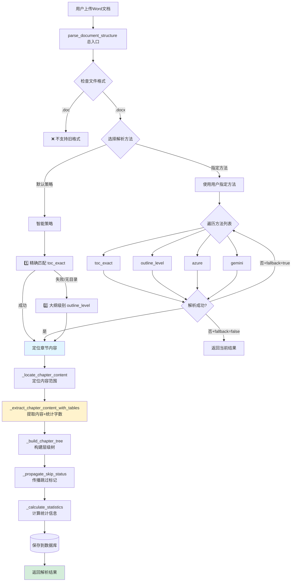
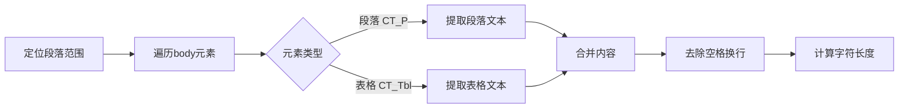

# 📋 文档解析流程完整说明

## 总体流程图



---

## 详细流程说明

### 🎯 阶段1: 入口与方法选择

**文件**: `structure_parser.py:150-274`

```python
def parse_document_structure(doc_path, methods=None, fallback=True)
```

**流程**:
1. 检查文件格式 (.doc → 报错, .docx → 继续)
2. 选择解析策略:
   - **用户指定方法**: 遍历 `methods` 列表,按顺序尝试
   - **默认智能策略**: `toc_exact` → `outline_level`

**可选解析方法**:
| 方法名 | 说明 | 函数 |
|--------|------|------|
| `toc_exact` | 精确匹配(基于目录) | `parse_by_toc_exact()` |
| `outline_level` | Word大纲级别识别 | `parse_by_outline_level()` |
| `azure` | Azure AI识别 | `parse_by_azure()` |
| `gemini` | Gemini AI识别 | `parse_by_gemini()` |

---

### 🔍 阶段2: 章节识别 (以 `outline_level` 为例)

**文件**: `structure_parser.py:348-419`

```python
def parse_by_outline_level(doc_path)
```

**步骤**:

#### 2.1 识别章节标题
- 调用 `_parse_chapters_by_outline_level(doc)`
- 遍历所有段落,检测:
  - Word大纲级别 (para._element.pPr.outlineLvl)
  - 段落样式 (para.style.name)
  - 编号格式 (para._element.pPr.numPr)

**识别结果示例**:
```python
[
    ChapterNode(
        id="ch_0",
        level=1,  # 初步识别的层级(可能不准确)
        title="第一章 项目概述",
        para_start_idx=15,  # 段落索引
        para_end_idx=None,  # 尚未确定
        word_count=0,      # 尚未统计
        preview_text="",
        auto_selected=True,
        skip_recommended=False
    ),
    ...
]
```

#### 2.2 智能层级修正 ⭐ 关键环节
**文件**: `structure_parser.py:376-396`

```python
# 使用LevelAnalyzer智能分析层级
analyzer = LevelAnalyzer()
corrected_levels = analyzer.analyze_toc_hierarchy_contextual(toc_like_items)

# 更新章节层级
for i, level in enumerate(corrected_levels):
    chapters[i].level = level  # 修正层级
```

**为什么需要修正?**
- Word大纲级别可能缺失/错误
- 编号格式不统一 (如 "1." vs "第一章")
- LevelAnalyzer 基于编号模式和上下文智能判断

---

### 📍 阶段3: 定位章节内容范围 ⭐⭐ **字数统计的关键环节**

**文件**: `structure_parser.py:2370-2527`

```python
def _locate_chapter_content(doc, chapters)
```

**核心逻辑**:

#### 3.1 计算章节边界
```python
# 按段落索引排序
chapters_sorted = sorted(chapters, key=lambda ch: ch.para_start_idx)

# 为每个章节计算 para_end_idx
for i, chapter in enumerate(chapters_sorted):
    if i < len(chapters_sorted) - 1:
        # 下一章节的前一段作为结束
        chapter.para_end_idx = chapters_sorted[i+1].para_start_idx - 1
    else:
        # 最后一章到文档末尾
        chapter.para_end_idx = len(doc.paragraphs) - 1
```

#### 3.2 提取内容并统计字数 ⭐⭐⭐
**文件**: `structure_parser.py:2402-2408`

```python
# 提取章节内容(包括表格)
content_text, preview_text = self._extract_chapter_content_with_tables(
    doc, chapter.para_start_idx, chapter.para_end_idx
)

# 计算字数
chapter.word_count = len(content_text.replace(' ', '').replace('\n', ''))
chapter.preview_text = preview_text
```

---

### 📝 阶段4: 内容提取详解 ⭐⭐⭐ **字数差异的根源**

**文件**: `structure_parser.py:2529-2616`

```python
def _extract_chapter_content_with_tables(doc, para_start_idx, para_end_idx)
```

**提取流程**:



**详细代码**:
```python
# 1. 定位body元素范围 (2541-2559行)
for body_idx, element in enumerate(doc.element.body):
    if isinstance(element, CT_P):  # 段落
        if para_count == para_start_idx:
            start_body_idx = body_idx
        if para_count == para_end_idx:
            end_body_idx = body_idx
            break

# 2. 提取段落 (2569-2578行)
if isinstance(element, CT_P):
    para = Paragraph(element, doc)
    text = para.text.strip()
    if text:
        content_parts.append(text)

# 3. 提取表格 (2580-2611行)
elif isinstance(element, CT_Tbl):
    table = Table(element, doc)
    for row in table.rows:
        row_data = [cell.text.strip() for cell in row.cells]
        row_text = ' | '.join(row_data)
        table_text_parts.append(row_text)

    # 添加表格标识
    table_content = f"[表格]\n" + '\n'.join(table_text_parts)
    content_parts.append(table_content)

# 4. 计算字数 (2613行)
full_content = '\n'.join(content_parts)
# ⭐ 关键: 去除空格和换行后计算长度
word_count = len(full_content.replace(' ', '').replace('\n', ''))
```

---

## 🔴 与Word大纲模式差异的原因定位

### 原因1: 段落边界不准确

**位置**: `_locate_chapter_content()` 函数 (2370行)

**问题**:
```python
# 当前逻辑
chapter.para_end_idx = next_chapter.para_start_idx - 1

# 可能的问题:
# - 如果两章节之间有空段落,可能遗漏内容
# - 如果层级判断错误,边界计算错位
```

**示例**:
```
段落15: "第一章 项目概述"  ← para_start_idx
段落16: "本项目位于..."
段落17: "总投资额..."
段落18: ""                  ← 空段落被遗漏?
段落19: "第二章 技术要求"  ← 下一章
```

### 原因2: 表格统计不完整

**位置**: `_extract_chapter_content_with_tables()` (2529行)

**问题**:
```python
# 提取表格时使用 cell.text
cell_text = '\n'.join(p.text.strip() for p in cell.paragraphs)

# 可能遗漏:
# - 表格中的嵌套表格
# - 单元格中的图片/文本框
# - 合并单元格的重复统计
```

**Word大纲模式的统计**:
- 可能包含文本框、图形对象中的文字
- 统计规则不同 (空格、标点、隐藏文字)

### 原因3: 字数计算方式差异

**位置**: 字数统计逻辑 (2408行, 2473行, 2493行等多处)

**当前方式**:
```python
word_count = len(content_text.replace(' ', '').replace('\n', ''))
```

**Word统计方式**:
- 中文: 按字符数
- 英文: 按单词数 (空格分隔)
- 标点: 可能不计入
- 批注/隐藏文字: 可选统计

**差异示例**:
```
文本: "Hello World 你好"
当前统计: len("HelloWorld你好") = 12
Word统计: 2个英文单词 + 2个中文字符 = 4
```

---

## 🎯 修复建议: 在哪个环节修改?

### 方案1: 优化段落边界计算 (推荐 ⭐⭐⭐)

**修改位置**: `_locate_chapter_content()` 函数

**目标**: 更精确地计算 `para_end_idx`

```python
# 改进后的逻辑
def _locate_chapter_content(self, doc, chapters):
    chapters_sorted = sorted(chapters, key=lambda ch: ch.para_start_idx)

    for i, chapter in enumerate(chapters_sorted):
        if i < len(chapters_sorted) - 1:
            next_start = chapters_sorted[i+1].para_start_idx

            # 🆕 改进: 向前查找,跳过空段落
            end_idx = next_start - 1
            while end_idx > chapter.para_start_idx:
                if doc.paragraphs[end_idx].text.strip():
                    break  # 找到非空段落
                end_idx -= 1

            chapter.para_end_idx = end_idx
        else:
            chapter.para_end_idx = len(doc.paragraphs) - 1

        # 提取内容...
```

### 方案2: 完善表格提取逻辑 (推荐 ⭐⭐)

**修改位置**: `_extract_chapter_content_with_tables()` 函数

**目标**: 更全面地提取表格内容

```python
# 改进: 检测嵌套表格、文本框
def _extract_chapter_content_with_tables(self, doc, para_start_idx, para_end_idx):
    # ... 现有逻辑 ...

    # 🆕 新增: 提取表格中的嵌套内容
    for cell in row.cells:
        # 提取段落文字
        cell_text = '\n'.join(p.text.strip() for p in cell.paragraphs)

        # 🆕 检测嵌套表格
        for table in cell.tables:
            nested_text = self._extract_table_text(table)
            cell_text += '\n' + nested_text

        row_data.append(cell_text)
```

### 方案3: 提供多种字数统计模式 (可选 ⭐)

**修改位置**: 字数统计逻辑

**目标**: 兼容Word统计方式

```python
def _calculate_word_count(self, text: str, mode: str = 'char') -> int:
    """
    计算字数

    Args:
        text: 文本内容
        mode: 统计模式
            - 'char': 字符模式(去除空格换行) - 当前方式
            - 'word': 单词模式(中英文混合)
            - 'word_style': Word风格统计
    """
    if mode == 'char':
        # 当前方式
        return len(text.replace(' ', '').replace('\n', ''))

    elif mode == 'word':
        # 中文按字符,英文按单词
        import re
        chinese = re.findall(r'[\u4e00-\u9fff]', text)
        english = re.findall(r'\b[a-zA-Z]+\b', text)
        return len(chinese) + len(english)

    elif mode == 'word_style':
        # 模拟Word统计(需要测试)
        # Word: 不计标点、空格作为分隔符
        words = text.split()
        return len(words)
```

### 方案4: 后处理校正 (兼容性最好 ⭐⭐⭐⭐)

**修改位置**: `_locate_chapter_content()` 函数末尾

**目标**: 与Word对照后微调

```python
def _locate_chapter_content(self, doc, chapters):
    # ... 现有逻辑 ...

    # 🆕 新增: 字数校正逻辑
    for chapter in chapters_sorted:
        # 提取内容
        content_text, _ = self._extract_chapter_content_with_tables(...)

        # 基础字数统计
        base_count = len(content_text.replace(' ', '').replace('\n', ''))

        # 🆕 校正系数(通过对比Word统计调整)
        # 经验值: 表格多的章节需 ×1.1, 纯文字章节 ×0.95
        correction_factor = 1.0

        # 检测表格密度
        table_count = content_text.count('[表格]')
        if table_count > 0:
            correction_factor = 1.0 + (table_count * 0.05)

        chapter.word_count = int(base_count * correction_factor)
```

---

## 💡 推荐的修复顺序

1. **先运行调试脚本** (`debug_word_count.py`)
   - 找出具体差异大的章节
   - 分析是段落边界问题还是表格统计问题

2. **应用方案1** (优化段落边界)
   - 修复空段落遗漏问题
   - 验证 `para_end_idx` 准确性

3. **应用方案2** (完善表格提取)
   - 如果差异主要来自表格多的章节
   - 增加嵌套表格、文本框支持

4. **可选: 应用方案4** (后处理校正)
   - 如果仍有系统性偏差
   - 添加校正系数微调

---

## 🔍 如何验证修复效果?

```bash
# 1. 运行调试脚本
python3 debug_word_count.py <project_id>

# 2. 对比输出
# 修复前:
# 数据库记录: 5000 字
# 实际统计:   5800 字
# 差异:       +800 字 (16.0%)

# 修复后:
# 数据库记录: 5750 字
# 实际统计:   5800 字
# 差异:       +50 字 (0.9%)
```

---

## 总结

| 环节 | 文件:行号 | 作用 | 修复优先级 |
|------|----------|------|-----------|
| 方法选择 | structure_parser.py:150 | 决定用哪种方式识别章节 | 低 |
| 章节识别 | structure_parser.py:348 | 找到所有章节标题 | 中 |
| 层级修正 | structure_parser.py:376 | 修正章节层级关系 | 中 |
| **内容定位** | **structure_parser.py:2370** | **计算para_end_idx** | **高 ⭐⭐⭐** |
| **内容提取** | **structure_parser.py:2529** | **提取段落+表格** | **高 ⭐⭐⭐** |
| **字数统计** | **structure_parser.py:2408** | **计算word_count** | **高 ⭐⭐⭐** |
| 树形构建 | structure_parser.py:2618 | 构建层级关系 | 低 |
| 统计汇总 | structure_parser.py:2699 | 计算总字数等 | 低 |

**核心修复点**:
- `_locate_chapter_content()` - 段落边界计算
- `_extract_chapter_content_with_tables()` - 内容提取完整性
- 字数统计逻辑 - 统计方式兼容性
