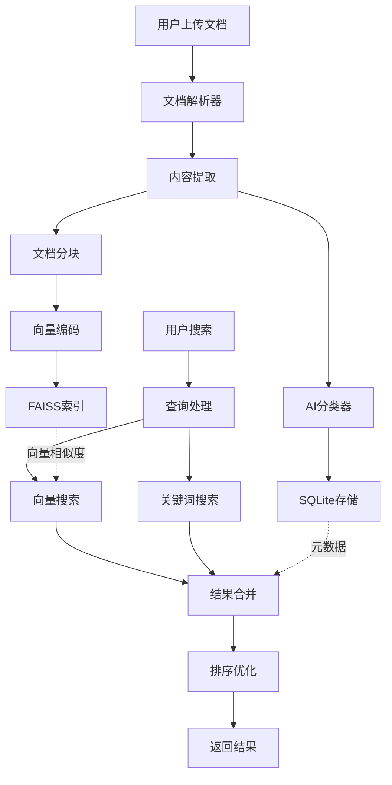

# AI标书系统文档中心

## 📚 文档导航

欢迎使用AI标书系统文档中心！这里包含了系统设计、开发指南、使用说明等完整的技术文档。

### 🎯 核心设计文档

| 文档 | 描述 | 状态 |
|------|------|------|
| [产品文档知识库设计方案](./product-document-management.md) | 完整的文档管理和向量搜索方案 | ✅ 完成 |

### 🏗️ 架构设计文档

| 文档 | 描述 | 状态 |
|------|------|------|
| [数据库架构设计](./architecture/database-schema.md) | SQLite + FAISS混合架构详解 | ✅ 完成 |
| [向量搜索设计](./architecture/vector-search-design.md) | 语义搜索和FAISS实现方案 | ✅ 完成 |
| [API接口设计](./architecture/api-interfaces.md) | RESTful API设计规范 | ✅ 完成 |

### 🛠️ 实施指南

| 文档 | 描述 | 状态 |
|------|------|------|
| [开发指南](./implementation/development-guide.md) | 开发环境配置和编码规范 | 🚧 计划中 |
| [部署指南](./implementation/deployment-guide.md) | 生产环境部署和配置 | 🚧 计划中 |
| [测试策略](./implementation/testing-strategy.md) | 测试框架和质量保证 | 🚧 计划中 |

### 👥 用户指南

| 文档 | 描述 | 状态 |
|------|------|------|
| [文档上传指南](./user-guides/document-upload-guide.md) | 如何上传和管理文档 | 🚧 计划中 |
| [搜索使用指南](./user-guides/search-user-guide.md) | 智能搜索功能使用说明 | 🚧 计划中 |
| [管理员指南](./user-guides/admin-guide.md) | 系统管理和维护指南 | 🚧 计划中 |

## 🎯 系统概述

AI标书系统是一个智能的投标文档管理和生成平台，核心功能包括：

### 📁 产品文档知识库
- **智能分类**: 按技术/实施/服务/案例四维度分类
- **向量搜索**: 基于FAISS的语义搜索能力
- **内容解析**: AI自动提取和结构化文档内容
- **多格式支持**: PDF、Word、PPT、Excel等格式

### 🔍 智能搜索引擎
- **语义理解**: 理解查询意图，不只是关键词匹配
- **混合检索**: 结合向量搜索和全文搜索
- **智能排序**: 基于相关性和重要性的结果排序
- **个性化推荐**: 基于使用历史的智能推荐

### 🎪 投标支持功能
- **需求匹配**: 自动匹配招标需求与产品能力
- **标书生成**: 基于知识库生成标书章节
- **模板管理**: 行业化标书模板库
- **多项目复用**: 支持不同项目的文档复用

## 🚀 快速开始

### 环境要求
- Python 3.8+
- SQLite 3.x
- Node.js 14+ (可选，用于前端开发)

### 安装依赖
```bash
cd ai_tender_system
pip install -r requirements.txt
```

### 启动系统
```bash
python run.py
# 或
python web/app.py
```

### 访问地址
- 主页: http://localhost:8082
- 知识库管理: http://localhost:8082/knowledge_base.html
- API文档: http://localhost:8082/api/docs

## 🏗️ 系统架构

```
ai_tender_system/
├── web/                    # Web应用层
│   ├── app.py             # Flask主应用
│   ├── templates/         # HTML模板
│   └── static/            # 静态资源
├── modules/               # 业务模块层
│   ├── knowledge_base/    # 知识库管理
│   ├── vector_engine/     # 向量搜索引擎
│   └── document_parser/   # 文档解析器
├── common/                # 共享组件层
│   ├── database.py        # 数据库管理
│   ├── config.py          # 配置管理
│   └── logger.py          # 日志管理
├── data/                  # 数据存储层
│   ├── knowledge_base.db  # SQLite数据库
│   ├── vector_indexes/    # FAISS向量索引
│   ├── uploads/           # 上传文件
│   └── logs/              # 系统日志
└── docs/                  # 文档中心
    ├── README.md          # 文档导航 (本文件)
    ├── architecture/      # 架构设计
    ├── implementation/    # 实施指南
    └── user-guides/       # 用户指南
```

## 🔧 核心技术栈

### 后端技术
- **Web框架**: Flask + Flask-CORS
- **数据库**: SQLite (关系数据) + FAISS (向量索引)
- **AI模型**: sentence-transformers, OpenAI API
- **文档解析**: PyPDF2, python-docx, python-pptx

### 前端技术
- **UI框架**: Bootstrap 5
- **JavaScript**: 原生JS + Axios
- **图表库**: Chart.js (可选)
- **图标库**: Bootstrap Icons

### 数据处理
- **向量化**: sentence-transformers/paraphrase-multilingual-MiniLM-L12-v2
- **文本处理**: jieba (中文分词), re (正则表达式)
- **文件处理**: Pillow (图像), openpyxl (Excel)

## 📊 数据流图



## 🔒 安全和权限

### 数据安全
- **分级管理**: 4级安全分类 (公开/内部/机密/绝密)
- **访问控制**: 基于角色的权限管理
- **审计日志**: 完整的操作记录和追踪

### 系统安全
- **文件安全**: 类型验证和内容扫描
- **API安全**: 认证和授权机制
- **数据备份**: 自动备份和恢复机制

## 📈 性能特性

### 搜索性能
- **毫秒级响应**: FAISS向量搜索毫秒级响应
- **并发支持**: 支持10-20个并发用户
- **缓存优化**: 智能缓存常用查询结果

### 存储性能
- **轻量级**: SQLite零配置部署
- **可扩展**: 支持PB级文档存储
- **高效压缩**: 向量数据压缩存储

## 🤝 贡献指南

### 开发流程
1. Fork 项目到个人仓库
2. 创建功能分支 (`git checkout -b feature/AmazingFeature`)
3. 提交更改 (`git commit -m 'Add some AmazingFeature'`)
4. 推送到分支 (`git push origin feature/AmazingFeature`)
5. 创建 Pull Request

### 代码规范
- **Python**: 遵循 PEP 8 代码风格
- **JavaScript**: 使用 ES6+ 语法
- **文档**: 使用 Markdown 格式
- **注释**: 中英文混合，重要逻辑必须注释

## 📞 联系信息

### 开发团队
- **项目负责人**: AI标书系统开发团队
- **技术支持**: 通过 GitHub Issues 提交问题
- **文档维护**: 开发团队持续更新

### 更新记录
- **v1.0** (2025-09-27): 产品文档知识库设计方案完成
- **v1.1** (计划中): 数据库架构设计文档
- **v1.2** (计划中): 向量搜索实现指南

---

**最后更新**: 2025年9月27日
**文档版本**: v1.0
**维护状态**: 🟢 积极维护中