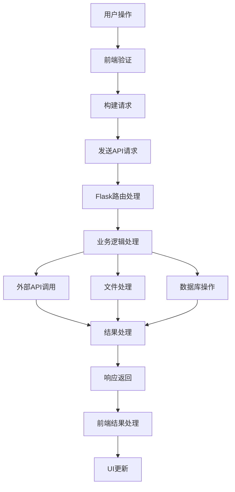

# AI智慧标书系统 - API使用文档

## 概述

本文档详细记录了AI智慧标书系统的API架构、接口规范和使用方式。系统采用Flask后端 + HTML/JavaScript前端架构，提供完整的招标文档处理、公司管理、商务应答等功能。

## 系统架构 (Updated 2025-09-12 - Single Page Architecture ✅)

```
Frontend (Single Page App) ←→ Flask API ←→ Business Modules ←→ External APIs
         ↓                        ↓              ↓              ↓
- index.html (Tabs-based)    - Flask Routes  - TenderExtractor  - LLM APIs
  ├── 招标信息提取 (Tab)    - API Endpoints  - P2P Processor    - File Processing  
  ├── 商务应答 (Tab) ✅      - Static Routes  - MCP Processor ✅  - Image Upload
  ├── 点对点应答 (Tab)       - Error Handling - Doc Processor    
  ├── 技术方案生成 (Tab)     ✅ Fixed Issues                     
  └── 公司管理 (Tab)                                            
- js/common.js                                                  
- js/state-manager.js                                           
- GlobalCompanyManager (Inline)                                 
```

**架构特点**:
- ✅ Bootstrap标签页单页面应用
- ✅ 统一状态管理 (StateManager + GlobalCompanyManager)
- ✅ 公司信息跨标签页同步
- ✅ MCP处理器集成完成

## 后端API接口详细规范

### 1. 系统状态与配置接口

#### 1.1 健康检查
- **路径**: `GET /api/health`
- **描述**: 系统健康状态检查
- **响应示例**:
```json
{
  "status": "healthy",
  "version": "2.0.0", 
  "timestamp": "2025-09-11T10:30:00.000Z",
  "tender_info_available": true,
  "point_to_point_available": true
}
```

#### 1.2 获取API配置
- **路径**: `GET /api/config`
- **描述**: 获取系统API配置信息（隐藏敏感信息）
- **响应示例**:
```json
{
  "success": true,
  "config": {
    "api_endpoint": "https://api.deepseek.com/v1/chat/completions",
    "model_name": "deepseek-chat",
    "max_completion_tokens": 4000,
    "has_api_key": true
  }
}
```

#### 1.3 API密钥管理 (Enhanced Error Handling 2025-09-12)
- **获取默认密钥**: `GET /api/get-default-api-key`
  - 返回前10位API密钥用于验证
- **保存密钥**: `POST /api/save-key`
  - 请求体: `{"api_key": "your_api_key"}`
  - 响应: `{"success": true, "message": "API密钥保存成功"}`
- **安全增强**: 
  - 前端API密钥解密现在包含base64验证
  - 自动清理损坏的API密钥数据
  - 增强错误日志记录

### 2. 文件处理接口

#### 2.1 通用文件上传
- **路径**: `POST /upload`
- **描述**: 支持多种文件类型上传
- **请求参数**:
  - `file`: 文件对象（multipart/form-data）
  - `type`: 文件类型（可选，默认tender_info）
- **响应示例**:
```json
{
  "success": true,
  "filename": "tender_document.pdf",
  "file_path": "/path/to/upload/tender_document.pdf",
  "message": "文件上传成功"
}
```

#### 2.2 文件下载
- **路径**: `GET /download/<filename>`
- **描述**: 从output目录下载生成的文件
- **响应**: 文件流（as_attachment=True）

### 3. 招标信息提取接口

#### 3.1 完整信息提取
- **路径**: `POST /extract-tender-info`
- **描述**: 一次性提取招标文档中的所有信息
- **请求参数**:
  - `file`: 招标文档文件
  - `api_key`: API密钥（可选，优先使用环境变量）
- **响应示例**:
```json
{
  "success": true,
  "data": {
    "tenderer": "某某政府采购中心",
    "agency": "招标代理公司",
    "project_name": "智慧城市建设项目",
    "project_number": "ZB2024-001",
    "bidding_method": "公开招标",
    "bidding_location": "某某市政府",
    "bidding_time": "2024年12月15日 09:00",
    "winner_count": "1",
    "business_license": {
      "required": true,
      "description": "有效营业执照副本"
    },
    "technical_scoring_items": [
      {
        "name": "技术方案完整性",
        "weight": "20分",
        "criteria": "方案完整性和可行性评分",
        "source": "技术评分标准第1条"
      }
    ]
  },
  "message": "招标信息提取成功"
}
```

#### 3.2 分步信息提取
- **路径**: `POST /extract-tender-info-step`
- **描述**: 分步骤提取招标信息
- **请求参数**:
  - `step`: 提取步骤（"1", "2", "3"）
  - `file_path`: 文件路径
  - `api_key`: API密钥
- **步骤说明**:
  - 步骤1：基本信息（项目名称、招标人等）
  - 步骤2：资质要求分析
  - 步骤3：技术评分标准

### 4. 公司管理接口

#### 4.1 公司列表 (Fixed Response Format 2025-09-12)
- **路径**: `GET /api/companies`
- **描述**: 获取所有公司配置
- **响应示例**:
```json
{
  "success": true,
  "companies": [
    {
      "id": "comp001",
      "companyName": "某某科技有限公司",
      "created_at": "2024-09-01T10:00:00",
      "updated_at": "2024-09-10T15:30:00"
    }
  ]
}
```
- **重要修复**: 前端现在正确处理响应格式，提取`response.companies`数组而不是直接使用response

#### 4.2 公司详细信息
- **路径**: `GET /api/companies/<company_id>`
- **描述**: 获取指定公司的详细信息
- **响应**: 包含完整公司信息的JSON对象

#### 4.3 创建公司
- **路径**: `POST /api/companies`
- **请求体**:
```json
{
  "companyName": "新公司名称",
  "legalRepresentative": "法定代表人",
  "registeredAddress": "注册地址",
  "socialCreditCode": "统一社会信用代码"
}
```

#### 4.4 更新公司
- **路径**: `PUT /api/companies/<company_id>`
- **请求体**: 包含需要更新的字段

#### 4.5 删除公司
- **路径**: `DELETE /api/companies/<company_id>`
- **响应**: `{"success": true, "message": "公司删除成功"}`

### 5. 公司资质文件管理

#### 5.1 获取资质文件列表
- **路径**: `GET /api/companies/<company_id>/qualifications`
- **响应**: 公司所有资质文件信息

#### 5.2 上传资质文件
- **路径**: `POST /api/companies/<company_id>/qualifications/upload`
- **请求**: multipart/form-data，包含多个资质文件
- **参数**:
  - `qualifications[<key>]`: 资质文件
  - `qualification_names`: 自定义资质名称映射（JSON字符串）

#### 5.3 下载资质文件
- **路径**: `GET /api/companies/<company_id>/qualifications/<qualification_key>/download`
- **响应**: 文件流

### 6. 商务应答处理接口

#### 6.1 处理商务应答 ⚡ **ENHANCED 2025-09-12**
- **路径**: `POST /process-business-response`
- **描述**: 基于公司信息和模板生成商务应答文档，使用MCP处理器自动填充投标人信息，支持预览和编辑功能
- **请求参数** ⚡ **UPDATED**:
  - `template_file`: ✅ 商务应答模板文件 (.docx, .doc)
  - `company_id`: ✅ 公司ID（从已配置公司中选择）
  - `project_name`: 项目名称
  - `tender_no`: 招标编号  
  - `date_text`: 日期信息
  - `use_mcp`: 是否使用MCP处理器（默认true）

**⚠️ 重要变更**:
- 文件字段名从 `file` 更改为 `template_file`
- 公司信息通过 `company_id` 从JSON配置文件自动加载
- 移除了手动输入的公司字段，改用统一公司管理
- ⚡ **2025-09-12**: MCP方法调用修复 - `process_business_response()` 替代 `process_bidder_name()`
- ⚡ **2025-09-12**: 智能日期处理恢复 - 激活完整的日期填充和重复清理功能

- **响应示例**:
```json
{
  "success": true,
  "message": "商务应答处理完成",
  "download_url": "/download/business_response_xxx.docx",
  "filename": "business_response_xxx.docx",
  "processing_steps": {
    "text": {"success": true, "message": "文本替换完成", "count": 15},
    "tables": {"success": true, "message": "表格处理完成", "count": 3},
    "images": {"success": true, "message": "图片插入完成", "count": 5}
  },
  "statistics": {
    "text_replacements": 15,
    "tables_processed": 3,
    "fields_filled": 25,
    "images_inserted": 5
  }
}
```

## 🆕 **文档预览与编辑接口** ⚡ **NEW 2025-09-12**

### 11. 文档预览编辑系统

#### 11.1 文档预览
- **路径**: `GET /api/document/preview/<filename>`
- **描述**: 将Word文档转换为HTML格式进行预览
- **响应示例**:
```json
{
  "success": true,
  "filename": "business_response_20240912.docx",
  "html_content": "<html><body><h1>商务应答文档</h1>...</body></html>",
  "metadata": {
    "original_filename": "business_response_20240912.docx",
    "file_size": 1048576,
    "last_modified": "2024-09-12T10:30:00",
    "conversion_time": "0.532s"
  }
}
```

**技术实现**:
- 使用`python-docx`解析Word文档结构
- 使用`BeautifulSoup4`处理HTML转换
- 保留基本格式（标题、段落、表格、列表）
- 自动处理图片和样式转换

#### 11.2 编辑器文档加载
- **路径**: `POST /api/editor/load-document`
- **描述**: 加载Word文档到编辑器进行编辑
- **请求参数**:
  - `file`: Word文档文件 (multipart/form-data)
- **响应示例**:
```json
{
  "success": true,
  "html_content": "<p>可编辑的HTML内容</p>",
  "original_filename": "document.docx",
  "supported_formats": [".docx", ".doc"],
  "editor_config": {
    "toolbar": "standard",
    "plugins": ["table", "link", "image"],
    "language": "zh_CN"
  }
}
```

**特殊功能**:
- 双重MIME类型检测（扩展名+MIME类型）
- 文件大小验证（最大10MB）
- 错误时提供详细的失败原因
- 支持拖拽和文件选择两种上传方式

#### 11.3 编辑器文档保存
- **路径**: `POST /api/editor/save-document`
- **描述**: 将编辑器内容保存为Word文档
- **请求体**:
```json
{
  "html_content": "<p>编辑后的HTML内容</p>",
  "filename": "edited_document",
  "options": {
    "include_styles": true,
    "preserve_formatting": true
  }
}
```

- **响应**: Word文档的二进制流（直接下载）
- **Content-Type**: `application/vnd.openxmlformats-officedocument.wordprocessingml.document`
- **文件名**: 自动设置为 `{filename}.docx`

**技术特点**:
- HTML到Word的高保真转换
- 支持表格、列表、图片等复杂格式
- 自动清理和优化HTML内容
- 错误处理和格式兼容性检查

#### 11.4 编辑器图片上传
- **路径**: `POST /api/editor/upload-image`
- **描述**: 编辑器中的图片上传功能
- **请求参数**:
  - `image`: 图片文件 (multipart/form-data)
- **响应示例**:
```json
{
  "success": true,
  "location": "/api/images/upload_20240912_001.jpg",
  "filename": "upload_20240912_001.jpg",
  "size": 245760,
  "dimensions": {
    "width": 800,
    "height": 600
  }
}
```

### 7. 文档与表格处理接口

#### 7.1 文档处理
- **路径**: `POST /api/document/process`
- **请求体**:
```json
{
  "file_path": "/path/to/document",
  "options": {
    "extract_text": true,
    "process_tables": true
  }
}
```

#### 7.2 表格分析
- **路径**: `POST /api/table/analyze`
- **请求体**:
```json
{
  "table_data": {
    "headers": ["列1", "列2"],
    "rows": [["值1", "值2"]]
  }
}
```

#### 7.3 表格处理
- **路径**: `POST /api/table/process`
- **请求体**:
```json
{
  "table_data": {},
  "options": {
    "fill_company_info": true,
    "apply_formatting": true
  }
}
```

### 8. 技术方案生成接口

#### 8.1 生成技术方案
- **路径**: `POST /generate-proposal`
- **描述**: 基于招标文件和产品文档生成技术方案
- **请求参数**:
  - `techTenderFile`: 招标文件
  - `productFile`: 产品文档
- **状态**: 功能正在迁移中
- **响应**: 
```json
{
  "success": false,
  "message": "技术方案生成功能正在迁移中"
}
```

### 9. 商务文件管理

#### 9.1 获取商务文件列表
- **路径**: `GET /api/business-files`
- **描述**: 获取output目录中的商务应答文件列表
- **响应示例**:
```json
{
  "success": true,
  "files": [
    {
      "name": "business_response_20240911.docx",
      "size": 1048576,
      "created": "2024-09-11T10:30:00",
      "modified": "2024-09-11T10:35:00",
      "path": "/path/to/output/business_response_20240911.docx"
    }
  ]
}
```

### 10. 项目配置接口

#### 10.1 获取项目配置
- **路径**: `GET /api/project-config`
- **描述**: 读取招标信息提取模块生成的项目配置
- **响应示例**:
```json
{
  "success": true,
  "projectInfo": {
    "projectName": "智慧城市建设项目",
    "projectNumber": "ZB2024-001",
    "tenderer": "政府采购中心",
    "agency": "招标代理公司",
    "biddingMethod": "公开招标",
    "biddingLocation": "市政府大楼",
    "biddingTime": "2024-12-15 09:00"
  }
}
```

## 前端组件API调用映射 (Updated 2025-09-12 - Single Page Architecture)

### 单页面应用（index.html）- 集成所有功能

**架构变更**:
- 所有功能模块已从独立JS文件迁移到index.html内联JavaScript
- 采用选项卡式界面，统一状态管理
- 实现GlobalCompanyManager统一公司选择管理

### 1. 招标信息提取功能 (原tender_info.js)

**主要API调用**:
- `/extract-tender-info` - 完整信息提取
- `/extract-tender-info-step` - 分步提取

**关键函数**:
- `submitTenderExtraction()` - 提交提取任务
- `performStepwiseExtraction()` - 执行分步提取
- `displayBasicInfo()`, `displayQualificationRequirements()`, `displayTechnicalScoring()` - 结果展示

**数据流**:
```
用户上传文件 → 文件验证 → API调用 → 进度显示 → 结果解析 → 分类展示
```

### 2. 公司管理功能 (原company_selection.js)

**主要API调用**:
- `/api/companies` - CRUD操作（已修复响应格式问题）
- `/api/companies/<id>/qualifications/*` - 资质管理
- `/api/project-config` - 项目信息

**关键功能**:
- 公司信息表单管理（集成到GlobalCompanyManager）
- 资质文件上传下载
- 表单状态跟踪（FormStateManager）
- 标签切换拦截机制

**状态管理增强**:
- 使用GlobalCompanyManager统一管理所有公司选择器
- 支持拖拽和粘贴图片上传
- 自动保存状态到StateManager
- 跨选项卡公司选择同步

### 3. 商务应答功能 (原business_response.js)

**主要API调用**:
- `/process-business-response` - 商务应答处理
- `/api/companies` - 获取公司列表（统一通过GlobalCompanyManager）
- `/api/project-config` - 项目信息

**处理流程**:
```
统一公司选择 → 选择模板 → 填写项目信息 → 提交处理 → 进度跟踪 → 结果下载
```

**特色功能**:
- 处理步骤可视化显示
- 统计信息展示
- 文档预览功能
- 与GlobalCompanyManager集成

### 4. 点对点应答功能 (原point_to_point.js)

**主要API调用**:
- `/upload` - 文件上传处理

**功能特点**:
- 简化的文件处理流程
- 拖拽上传支持
- 进度条显示
- 统一公司信息访问

### 5. 技术方案功能 (原tech_proposal.js)

**主要API调用**:
- `/generate-proposal` - 技术方案生成

**当前状态**: 功能正在迁移，API返回占位响应
**集成增强**: 使用统一的公司信息获取接口

### 6. 统一状态管理层

**GlobalCompanyManager**:
```javascript
const GlobalCompanyManager = {
    syncCompanySelectors(companyId),     // 同步所有公司选择器
    updateCompanyStatusUI(companyId),    // 更新UI状态指示
    bindCompanySelectors(),              // 绑定选择器事件
    init()                              // 初始化管理器
};
```

**统一公司信息访问**:
```javascript
const getSelectedCompanyInfo = async () => {
    const companyId = StateManager.getCompanyId();
    if (!companyId) throw new Error('请先选择公司');
    return await apiRequest(`/api/companies/${companyId}`, 'GET');
};
```

### 7. word-editor.js - Word编辑器 (独立组件) ⚡ **ENHANCED 2025-09-12**

**主要API调用**:
- `/api/editor/load-document` - 加载Word文档
- `/api/editor/save-document` - 保存为Word文档
- `/api/editor/upload-image` - 图片上传
- 🆕 `/api/document/preview/<filename>` - 文档预览API（新增集成）

**特色功能**:
- 集成TinyMCE富文本编辑器
- Word文档导入导出
- 图片粘贴上传（已增强错误处理）
- 实时保存提示
- 🆕 **双重文档加载机制** - API预览优先，文件上传备用
- 🆕 **MIME类型兼容性** - 支持不同浏览器的Word文档检测
- 🆕 **模态框集成** - 可嵌入Bootstrap模态框使用

**使用方式**:
```javascript
// 集成到商务应答功能
const wordEditor = new WordEditor('editor-container', {
    height: 600,
    placeholder: '请输入内容或加载文档...'
});

// 加载文档进行编辑
await wordEditor.loadDocument(file);

// 保存编辑内容
await wordEditor.saveDocument('edited_document');
```

**独立性**: 此组件可独立运行，也已集成到单页面应用的预览编辑功能中

## 通用JavaScript工具库

### common.js - 公共功能 (Enhanced 2025-09-12)

**核心功能**:
- `showNotification()` - 通知显示
- `downloadFile()` - 文件下载
- `setupDragDrop()` - 拖拽上传
- `apiRequest()` - API请求封装
- `enablePasteImageUpload()` - 图片粘贴上传

**API密钥管理增强**:
- `encryptApiKey()` - API密钥加密
- `decryptApiKey()` - API密钥解密（增强错误处理）
- `isValidBase64()` - Base64格式验证（新增）
- 自动清理损坏的API密钥数据
- 增强的错误日志和调试支持

### state-manager.js - 状态管理 (Enhanced 2025-09-12)

**主要功能**:
- 跨页面状态保持
- localStorage操作封装
- URL参数管理
- 页面间消息传递

**增强功能**:
- `broadcastStateChange()` - 广播状态变更到其他页面
- `onStateChange()` - 监听状态变更事件
- `onStateChangeByKey()` - 监听特定键的状态变更
- `validateCompanyState()` - 验证公司状态一致性
- `syncAllPages()` - 强制同步所有页面状态

**状态键定义**:
```javascript
KEYS: {
  API_KEY: 'ai_tender_api_key_encrypted',
  COMPANY_ID: 'current_company_id', 
  UPLOAD_FILES: 'upload_files_info',
  PAGE_CONTEXT: 'page_context'
}
```

**跨页面通信**:
- 使用localStorage事件进行实时状态同步
- 支持状态变更的源页面识别
- 自动清理临时消息数据

## 外部API集成

### 1. LLM服务集成
- **默认服务**: DeepSeek API
- **端点**: `https://api.deepseek.com/v1/chat/completions`
- **模型**: `deepseek-chat`
- **用途**: 招标信息智能提取
- **认证**: Bearer Token

### 2. 文档处理服务
- **内部实现**: 基于Python-docx等库
- **支持格式**: .docx, .doc, .pdf
- **功能**: 文档读取、解析、生成

### 3. 图片处理服务
- **功能**: 图片上传、格式转换
- **支持格式**: jpg, png, pdf等
- **集成点**: 资质文件上传、编辑器图片

## API使用模式和最佳实践

### 1. 错误处理模式
```javascript
fetch('/api/endpoint')
  .then(response => {
    if (!response.ok) {
      throw new Error(`HTTP ${response.status}: ${response.statusText}`);
    }
    return response.json();
  })
  .then(data => {
    if (!data.success) {
      throw new Error(data.error || data.message || '未知错误');
    }
    // 处理成功响应
  })
  .catch(error => {
    console.error('API调用失败:', error);
    showNotification('操作失败: ' + error.message, 'error');
  });
```

### 2. 文件上传模式
```javascript
const formData = new FormData();
formData.append('file', file);
formData.append('company_id', companyId);

fetch('/api/upload-endpoint', {
  method: 'POST',
  body: formData
})
```

### 3. 进度显示模式
```javascript
// 显示进度条
progressBar.style.display = 'block';
const progressInterval = setInterval(() => {
  progress += Math.random() * 15;
  if (progress > 90) progress = 90;
  progressBar.style.width = progress + '%';
}, 200);

// API调用完成后清理
clearInterval(progressInterval);
progressBar.style.width = '100%';
```

### 4. 状态管理模式
```javascript
// 保存状态
StateManager.setCompanyId(companyId);
StateManager.setPageContext({
  tenderInfoExtracted: true,
  extractedData: result
});

// 读取状态
const companyId = StateManager.getCompanyId();
const pageContext = StateManager.getPageContext();
```

## 安全考虑

### 1. API密钥管理
- 环境变量优先
- 前端显示脱敏（仅前10位）
- 加密存储到localStorage

### 2. 文件上传安全
- 文件类型验证
- 文件大小限制
- 安全文件名处理
- 路径遍历防护

### 3. 跨域和CSRF
- CORS配置
- 文件上传使用multipart/form-data
- 状态验证

## 性能优化

### 1. 异步处理
- 长时间操作使用进度条
- 超时控制（默认2分钟）
- 请求取消支持

### 2. 缓存策略
- 公司列表缓存
- 状态管理器本地存储
- 静态资源缓存

### 3. 错误恢复
- 自动重试机制（最多3次）
- 网络错误友好提示
- 状态恢复能力

## API调用流程图



## 常见问题和解决方案 (Updated 2025-09-12)

### 1. API密钥问题 (Enhanced)
- **问题**: 提示"API密钥未配置"或解密失败
- **解决**: 检查环境变量DEFAULT_API_KEY或在页面中手动设置
- **新增**: 如遇到解密错误，系统会自动清理损坏的API密钥数据

### 2. 公司列表加载问题 (Fixed)
- **问题**: "companies.forEach is not a function"错误
- **解决**: 已修复API响应格式处理，正确提取companies数组
- **技术细节**: 使用`const companies = response.companies || response || [];`

### 3. 文件上传失败
- **问题**: 文件上传超时或失败
- **解决**: 检查文件大小（限制10MB）、网络连接、文件格式

### 4. 跨页面状态丢失 (Enhanced)
- **问题**: 切换页面后选择的公司信息丢失
- **解决**: 使用StateManager保存状态，检查localStorage
- **新增**: 单页面应用架构减少了状态丢失问题，增强了状态同步

### 5. 进度条不显示
- **问题**: 长时间操作没有进度提示
- **解决**: 检查progressBar元素是否存在，确认事件监听正确绑定

### 6. 选项卡间状态不一致 (New)
- **问题**: 不同选项卡间公司选择不同步
- **解决**: 使用GlobalCompanyManager统一管理，自动同步所有公司选择器

### 7. 页面刷新后状态丢失 (New)
- **问题**: 刷新页面后公司选择等状态重置
- **解决**: StateManager支持URL参数同步，确保状态持久化

## 总结 (Updated 2025-09-12)

本API系统采用现代Web架构，提供了完整的招标文档处理能力。主要特点：

1. **完整的REST API设计**：覆盖所有业务功能
2. **智能文档处理**：集成LLM进行信息提取
3. **统一的单页面架构**：集成所有功能模块，改善用户体验
4. **增强的状态管理**：GlobalCompanyManager统一公司选择，跨组件状态同步
5. **健壮的错误处理**：全面的异常捕获、自动数据清理、用户友好提示
6. **灵活的状态管理**：支持跨页面数据保持、URL参数同步
7. **安全的文件处理**：完善的文件上传下载机制

### 2025-09-12更新要点：
- **架构简化**：从多页面迁移到单页面应用，减少状态管理复杂性
- **错误修复**：修复公司列表加载和API密钥解密关键错误
- **状态增强**：实现统一公司管理和跨组件状态同步
- **代码精简**：移除5个独立JS文件（约87,000行代码），提高维护性
- **🆕 功能增强**：新增文档预览编辑系统，完整的Word文档在线处理能力
- **🆕 API扩展**：新增4个预览编辑相关的API端点，完善文档处理生态

### 🆕 **新增API概览** ⚡ **NEW 2025-09-12**

| API端点 | 方法 | 功能描述 | 集成位置 |
|---------|------|----------|----------|
| `/api/document/preview/<filename>` | GET | Word文档转HTML预览 | 商务应答结果 |
| `/api/editor/load-document` | POST | 加载Word文档到编辑器 | TinyMCE编辑器 |
| `/api/editor/save-document` | POST | 编辑器内容保存为Word | TinyMCE编辑器 |
| `/api/editor/upload-image` | POST | 编辑器图片上传 | TinyMCE编辑器 |

**技术特点**:
- **双重加载机制**：API预览优先，文件上传备用，确保兼容性
- **格式转换增强**：Word ↔ HTML双向转换，保留基本格式
- **错误处理完备**：多层次降级方案，CDN失败时自动降级
- **用户体验优化**：模态框界面，实时编辑，一键保存下载

开发者可以基于这套API快速构建招标相关的应用功能，系统经过重构后提供了更好的扩展性和维护性，新增的预览编辑功能大幅提升了文档处理的用户体验。