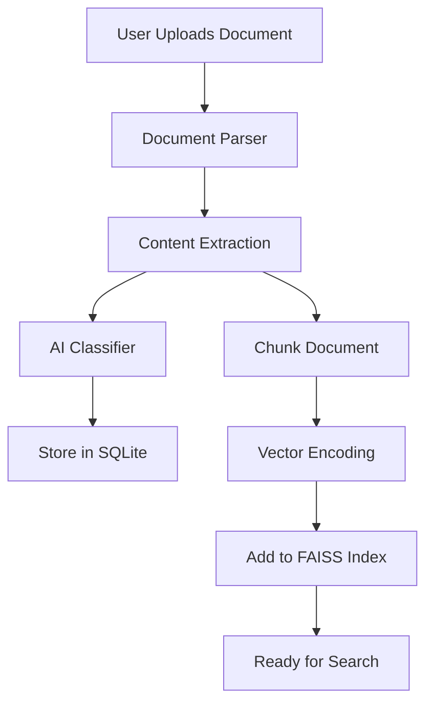

# System Architecture

The AI-Tender-System is a web-based application with a Python/Flask backend and a Vue.js frontend.

## High-Level Overview

The system is composed of the following layers:

-   **Frontend**: A single-page application (SPA) built with Vue.js that provides the user interface.
-   **Backend**: A Flask-based web server that exposes a RESTful API.
-   **Business Logic**: A set of Python modules that implement the core functionality of the system, such as document parsing, AI processing, and vector search.
-   **Data Storage**: A combination of a SQLite database for structured data, a FAISS index for vector search, and the local filesystem for storing uploaded files.

## Technology Stack

### Backend

-   **Web Framework**: Flask
-   **Database**: SQLite for relational data, FAISS for vector search
-   **AI Models**: Pluggable architecture supporting models like OpenAI GPT, Tongyi Qwen, and DeepSeek.
-   **Document Parsing**: PyMuPDF, python-docx, pdfplumber
-   **Text Processing**: LangChain, tiktoken, jieba

### Frontend

-   **Framework**: Vue.js 3 with Vite
-   **Language**: TypeScript
-   **UI Components**: Element Plus
-   **State Management**: Pinia
-   **HTTP Client**: Axios

## Project Structure

```
ai_tender_system/
├── web/                    # Web Application Layer (Flask)
│   ├── app.py             # Main Flask application
│   ├── templates/         # HTML templates
│   └── static/            # Static assets (CSS, JS, images)
├── modules/               # Business Logic Layer
│   ├── knowledge_base/    # Knowledge base management
│   ├── vector_engine/     # Vector search engine
│   └── document_parser/   # Document parser
├── common/                # Shared Components
│   ├── database.py        # Database management
│   ├── config.py          # Configuration management
│   └── llm_client.py      # LLM client
├── data/                  # Data Storage Layer
│   ├── knowledge_base.db  # SQLite database
│   ├── vector_indexes/    # FAISS vector indexes
│   ├── uploads/           # Uploaded files
│   └── logs/              # System logs
└── docs/                  # Documentation
```

## Data Flow

The following diagram illustrates the data flow when a user uploads a document:


