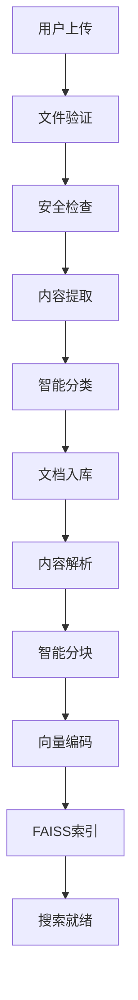

# 产品文档知识库建设方案

## 🎯 项目概述

本方案专注于**产品文档知识库建设**，旨在建立可复用的文档资产，支持多项目投标需求。采用渐进式设计理念，将文档管理与标书生成分离，优先建设高质量的知识库基础。

### 核心目标
- **文档集中管理**：统一存储和分类产品相关文档
- **智能内容解析**：AI提取和结构化文档内容
- **语义搜索能力**：基于向量技术的智能检索
- **多项目复用**：支持不同时间、不同项目的投标需求

## 📁 文档分类体系

基于技术生命周期的四层分类结构：

```
├── 技术文档 (tech) 🔧
│   ├── 产品规格、架构设计、API文档
│   ├── 技术白皮书、系统设计、接口说明
│   └── 性能指标、技术参数、兼容性说明
├── 实施文档 (impl) 📋
│   ├── 部署指南、配置手册、最佳实践
│   ├── 安装文档、集成方案、项目实施
│   └── 环境配置、数据迁移、系统集成
├── 服务文档 (service) 🛠️
│   ├── 运维手册、故障排除、用户培训
│   ├── 支持文档、升级指南、维护说明
│   └── 培训材料、操作手册、FAQ文档
└── 案例库 (cases) 📚
    ├── 成功案例、经验总结、FAQ
    ├── 客户证明、项目业绩、应用场景
    └── 行业方案、实施经验、最佳实践
```

### 分类优势
- **技术导向**：符合B2B产品的技术特点
- **流程清晰**：按技术→实施→服务→案例的逻辑链条
- **便于检索**：用户可快速定位所需文档类型
- **投标友好**：直接对应投标文档的组织结构

## 🗄️ 数据库架构设计

### SQLite + FAISS 混合架构

采用**关系数据库**存储元数据，**向量数据库**支持语义搜索的混合架构：

```sql
-- 1. 产品表
products
├── product_id INTEGER PRIMARY KEY
├── product_name VARCHAR(255) NOT NULL
├── product_category VARCHAR(100)      -- 产品分类
├── company_id INTEGER
├── description TEXT
└── is_active BOOLEAN DEFAULT TRUE

-- 2. 文档库表
document_libraries
├── library_id INTEGER PRIMARY KEY
├── library_name VARCHAR(255) NOT NULL
├── library_type VARCHAR(50)           -- 'tech'/'impl'/'service'/'cases'
├── owner_type VARCHAR(20)             -- 'product'
├── owner_id INTEGER                   -- product_id
├── privacy_level INTEGER DEFAULT 1    -- 1:公开 2:内部 3:机密 4:绝密
├── is_shared BOOLEAN DEFAULT FALSE
└── 时间戳字段...

-- 3. 文档表
documents
├── doc_id INTEGER PRIMARY KEY
├── library_id INTEGER NOT NULL
├── filename VARCHAR(255) NOT NULL
├── original_filename VARCHAR(255)
├── file_path VARCHAR(500) NOT NULL
├── file_type VARCHAR(20)              -- pdf/doc/docx/ppt/xlsx
├── file_size INTEGER
├── document_category VARCHAR(50)      -- tech/impl/service/cases
├── content_extracted TEXT             -- 提取的文本内容
├── ai_analysis TEXT                   -- AI分析结果JSON
├── applicable_products TEXT           -- 适用产品列表JSON
├── tags TEXT                          -- 文档标签JSON
├── privacy_classification INTEGER DEFAULT 1
└── 时间戳字段...

-- 4. 文档分块表
document_chunks
├── chunk_id INTEGER PRIMARY KEY
├── doc_id INTEGER NOT NULL
├── chunk_index INTEGER                -- 分块序号
├── content TEXT NOT NULL              -- 分块内容
├── chunk_type VARCHAR(50)             -- title/paragraph/table/code/image
├── metadata TEXT                      -- 分块元数据JSON
├── word_count INTEGER                 -- 分块字数
└── 时间戳字段...
```

### 向量搜索扩展

```sql
-- 向量模型管理
vector_models
├── model_id INTEGER PRIMARY KEY
├── model_name VARCHAR(255) UNIQUE     -- sentence-transformer/openai/custom
├── model_type VARCHAR(50)             -- 模型类型
├── dimension INTEGER NOT NULL         -- 向量维度
├── performance_metrics TEXT           -- 性能指标JSON
└── is_active BOOLEAN DEFAULT FALSE

-- 向量索引管理
vector_indexes
├── index_id INTEGER PRIMARY KEY
├── index_name VARCHAR(255) UNIQUE
├── model_id INTEGER NOT NULL
├── index_type VARCHAR(50)             -- flat/ivf/hnsw
├── dimension INTEGER NOT NULL
├── vector_count INTEGER DEFAULT 0
├── index_status VARCHAR(20)           -- building/ready/updating/error
└── index_file_path VARCHAR(500)

-- 文档向量存储
document_vectors
├── vector_id INTEGER PRIMARY KEY
├── chunk_id INTEGER NOT NULL UNIQUE
├── model_id INTEGER NOT NULL
├── vector_data BLOB NOT NULL          -- 序列化向量数据
├── vector_norm REAL                   -- L2范数优化
└── 时间戳字段...
```

### FAISS 向量索引文件

```
/data/vector_indexes/
├── tech_docs.faiss          # 技术文档向量索引
├── impl_docs.faiss         # 实施文档向量索引
├── service_docs.faiss      # 服务文档向量索引
├── cases_docs.faiss        # 案例文档向量索引
└── metadata/
    ├── id_mapping.pkl      # ID映射关系
    ├── chunk_metadata.json # 分块元数据
    └── index_config.json   # 索引配置
```

## 🔄 文档处理流程

### 1. 文档上传处理管道



### 2. 内容解析与结构化

```python
# 文档内容解析示例
def extract_document_content(file_path):
    return {
        "title": "文档标题",
        "sections": [
            {
                "heading": "产品概述",
                "content": "产品功能和特性描述",
                "level": 1
            },
            {
                "heading": "技术架构",
                "content": "系统架构设计说明",
                "level": 2
            }
        ],
        "tables": [
            {
                "caption": "技术参数表",
                "headers": ["参数名", "参数值", "说明"],
                "data": [["CPU", "8核", "处理器规格"]]
            }
        ],
        "images": [
            {
                "caption": "系统架构图",
                "path": "/images/architecture.png",
                "description": "整体架构示意图"
            }
        ],
        "metadata": {
            "doc_type": "tech",
            "confidence": 0.95,
            "key_topics": ["架构", "性能", "API"],
            "technical_level": "high"
        }
    }
```

### 3. 智能分块策略

```python
# 文档分块配置
CHUNK_CONFIG = {
    "chunk_size": 512,           # 每块token数
    "chunk_overlap": 50,         # 重叠token数
    "min_chunk_size": 100,       # 最小分块大小
    "max_chunk_size": 1000,      # 最大分块大小
    "preserve_structure": True,   # 保持文档结构
    "split_on_headers": True,    # 按标题分割
    "include_metadata": True     # 包含元数据
}

# 分块类型
CHUNK_TYPES = {
    "title": "标题块",
    "paragraph": "段落块",
    "table": "表格块",
    "code": "代码块",
    "image": "图片块",
    "list": "列表块"
}
```

### 4. 向量化处理

```python
# 向量化流程
def vectorize_document_chunks(chunks, model_name="sentence-transformers/paraphrase-multilingual-MiniLM-L12-v2"):
    """
    文档分块向量化处理
    """
    results = []
    for chunk in chunks:
        # 文本预处理
        cleaned_text = preprocess_text(chunk.content)

        # 向量编码
        vector = embedding_model.encode(cleaned_text)

        # 归一化
        normalized_vector = vector / np.linalg.norm(vector)

        results.append({
            "chunk_id": chunk.chunk_id,
            "vector": normalized_vector,
            "norm": np.linalg.norm(vector),
            "dimension": len(vector)
        })

    return results
```

## 🔍 智能搜索能力

### 1. 多模式搜索

```python
# 搜索模式
SEARCH_MODES = {
    "semantic": {
        "description": "语义搜索",
        "method": "vector_similarity",
        "use_case": "理解查询意图，找相关内容"
    },
    "keyword": {
        "description": "关键词搜索",
        "method": "full_text_search",
        "use_case": "精确匹配特定术语"
    },
    "hybrid": {
        "description": "混合搜索",
        "method": "combine_semantic_keyword",
        "use_case": "综合语义和关键词结果"
    }
}
```

### 2. 搜索接口设计

```python
def search_documents(
    query: str,
    categories: List[str] = None,      # 文档分类过滤
    products: List[int] = None,        # 产品范围过滤
    search_mode: str = "hybrid",       # 搜索模式
    top_k: int = 10,                   # 返回结果数
    min_score: float = 0.7,            # 最低相似度
    privacy_level: int = 1             # 权限级别
) -> List[SearchResult]:
    """
    智能文档搜索接口

    Returns:
        [
            {
                "doc_id": 123,
                "chunk_id": 456,
                "title": "产品技术白皮书",
                "content": "匹配的文档片段...",
                "category": "tech",
                "similarity_score": 0.85,
                "highlight": "高亮匹配文本",
                "metadata": {...}
            }
        ]
    """
```

### 3. 搜索优化策略

```python
# 搜索结果重排序
def rerank_search_results(results, query, user_context):
    """
    基于多个因素重新排序搜索结果：
    1. 相似度分数 (40%)
    2. 文档新鲜度 (20%)
    3. 文档权威性 (20%)
    4. 用户历史偏好 (20%)
    """
    pass

# 查询扩展
def expand_query(original_query):
    """
    查询扩展策略：
    1. 同义词扩展
    2. 技术术语规范化
    3. 行业相关词汇补充
    """
    pass
```

## 🎯 核心功能特性

### 1. 文档自动分类

```python
# AI文档分类器
class DocumentClassifier:
    def __init__(self):
        self.categories = ["tech", "impl", "service", "cases"]
        self.confidence_threshold = 0.8

    def classify(self, document_content):
        """
        基于文档内容自动分类
        """
        features = self.extract_features(document_content)
        prediction = self.model.predict(features)

        return {
            "predicted_category": prediction.category,
            "confidence": prediction.confidence,
            "indicators": prediction.reasoning,
            "manual_review_needed": prediction.confidence < self.confidence_threshold
        }

    def extract_features(self, content):
        """
        提取分类特征：
        - 技术关键词密度
        - 文档结构特征
        - 语言风格特征
        - 图表类型特征
        """
        pass
```

### 2. 知识提取引擎

```python
# 结构化知识提取
class KnowledgeExtractor:
    def extract_product_knowledge(self, document):
        """
        从文档中提取结构化知识
        """
        return {
            "features": self.extract_features(document),           # 产品功能特性
            "specifications": self.extract_specs(document),        # 技术规格参数
            "use_cases": self.extract_use_cases(document),        # 应用场景
            "architecture": self.extract_architecture(document),   # 架构信息
            "performance": self.extract_performance(document),     # 性能指标
            "compatibility": self.extract_compatibility(document), # 兼容性信息
            "security": self.extract_security(document),          # 安全特性
            "deployment": self.extract_deployment(document)       # 部署要求
        }

    def extract_features(self, document):
        """
        产品功能特性提取：
        - 核心功能列表
        - 特色功能说明
        - 功能模块划分
        """
        pass
```

### 3. 相似文档推荐

```python
# 文档相似度分析
class DocumentSimilarityAnalyzer:
    def find_similar_documents(self, doc_id, threshold=0.8, top_k=5):
        """
        查找相似文档，支持：
        - 内容相似度
        - 结构相似度
        - 主题相似度
        """
        pass

    def recommend_related_docs(self, query_context):
        """
        基于查询上下文推荐相关文档：
        - 同类型文档
        - 互补性文档
        - 更新版本文档
        """
        pass
```

## 🚀 实施计划

### Phase 1: 基础架构建设 (2-3周)

#### 1.1 数据库设计与实现
- [ ] **完善SQLite数据库结构**
  - 扩展现有knowledge_base表结构
  - 添加文档分类和元数据字段
  - 创建向量相关表结构
  - 建立合适的索引和约束

- [ ] **FAISS向量索引系统**
  - 部署FAISS库和依赖
  - 设计向量索引文件结构
  - 实现向量数据的序列化存储
  - 建立SQLite与FAISS的映射关系

#### 1.2 文档上传系统
- [ ] **多格式文件支持**
  - PDF文档解析 (PyPDF2/pdfplumber)
  - Word文档解析 (python-docx)
  - PPT文档解析 (python-pptx)
  - Excel文档解析 (openpyxl)

- [ ] **文件处理管道**
  - 文件验证和安全检查
  - 大文件分片上传支持
  - 文件存储路径管理
  - 上传进度反馈

#### 1.3 内容解析引擎
- [ ] **文本提取和预处理**
  - 文档结构识别
  - 文本清洗和标准化
  - 表格和图片信息提取
  - 元数据自动生成

### Phase 2: 智能处理功能 (3-4周)

#### 2.1 AI分类系统
- [ ] **文档自动分类**
  - 训练或配置分类模型
  - 实现分类置信度评估
  - 支持人工审核和纠正
  - 分类规则的持续优化

#### 2.2 向量化系统
- [ ] **文档向量化**
  - 集成sentence-transformers模型
  - 实现智能分块策略
  - 优化向量编码性能
  - 支持多种嵌入模型

- [ ] **FAISS索引优化**
  - 选择合适的索引类型
  - 索引构建和更新机制
  - 索引性能监控
  - 索引文件备份策略

#### 2.3 搜索功能实现
- [ ] **多模式搜索**
  - 语义搜索实现
  - 关键词搜索集成
  - 混合搜索算法
  - 结果排序和重排

- [ ] **搜索优化**
  - 查询扩展和同义词
  - 搜索结果缓存
  - 个性化搜索
  - 搜索性能优化

### Phase 3: 用户界面和体验 (2周)

#### 3.1 文档管理界面
- [ ] **文档库管理**
  - 分类浏览和导航
  - 批量上传和操作
  - 文档预览和编辑
  - 权限控制界面

#### 3.2 搜索界面
- [ ] **智能搜索框**
  - 自动补全和建议
  - 搜索历史记录
  - 高级搜索选项
  - 搜索结果展示

#### 3.3 数据分析和监控
- [ ] **使用统计分析**
  - 文档访问统计
  - 搜索行为分析
  - 系统性能监控
  - 用户反馈收集

## 💡 技术选型说明

### 数据存储
- **SQLite**: 零配置、轻量级、事务安全
- **FAISS**: 高性能向量检索、多种索引算法
- **本地文件系统**: 文档文件存储、易于备份

### AI模型
- **sentence-transformers**: 多语言语义理解
- **中文优化模型**: paraphrase-multilingual-MiniLM-L12-v2
- **可扩展性**: 支持OpenAI/Claude等API

### Web框架
- **Flask**: 轻量级、灵活性高
- **Bootstrap**: 响应式UI组件
- **Vue.js**: 前端交互增强

## 🔒 安全考虑

### 数据安全
- **权限控制**: 4级安全分类 (公开/内部/机密/绝密)
- **访问日志**: 完整的操作审计
- **数据备份**: 定期自动备份机制

### 系统安全
- **文件验证**: 类型检查和病毒扫描
- **输入过滤**: SQL注入和XSS防护
- **API安全**: 认证和授权机制

## 📊 性能指标

### 系统性能目标
- **文档上传**: 支持100MB以内文件秒级上传
- **内容解析**: 10页PDF文档1分钟内完成解析
- **向量检索**: 毫秒级搜索响应时间
- **并发用户**: 支持10-20个并发用户

### 存储规模预估
- **文档存储**: 单个产品1000个文档
- **向量数据**: 10万个文档块向量
- **数据库大小**: 100MB-1GB数据量
- **索引文件**: 100MB-500MB向量索引

## 🔮 后续扩展方向

### 1. 投标应用层
- **需求匹配引擎**: 招标需求自动匹配产品能力
- **标书生成器**: 基于知识库自动生成标书章节
- **模板管理**: 行业化标书模板库

### 2. 高级AI功能
- **内容生成**: 基于现有文档生成新内容
- **质量评估**: 文档质量自动评分
- **智能更新**: 文档过期提醒和更新建议

### 3. 协作功能
- **多用户协作**: 文档共享和协同编辑
- **版本控制**: 文档版本历史和回滚
- **工作流**: 文档审核和发布流程

---

## 📞 联系信息

**文档维护**: AI标书系统开发团队
**创建时间**: 2025年9月27日
**文档版本**: v1.0
**更新频率**: 根据开发进度持续更新