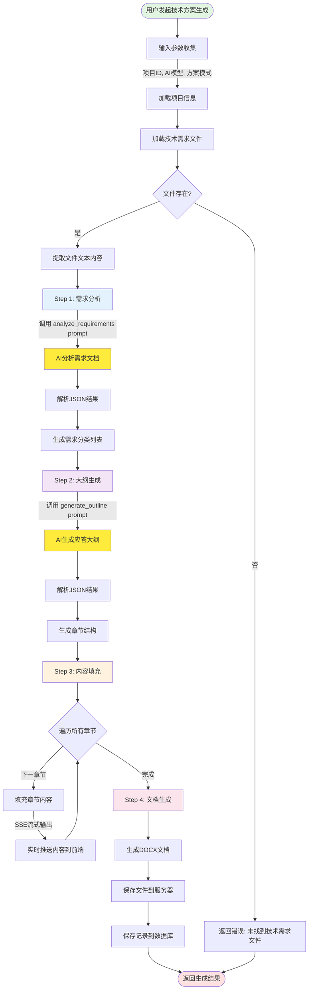
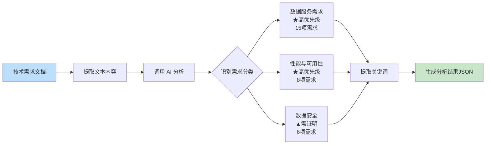
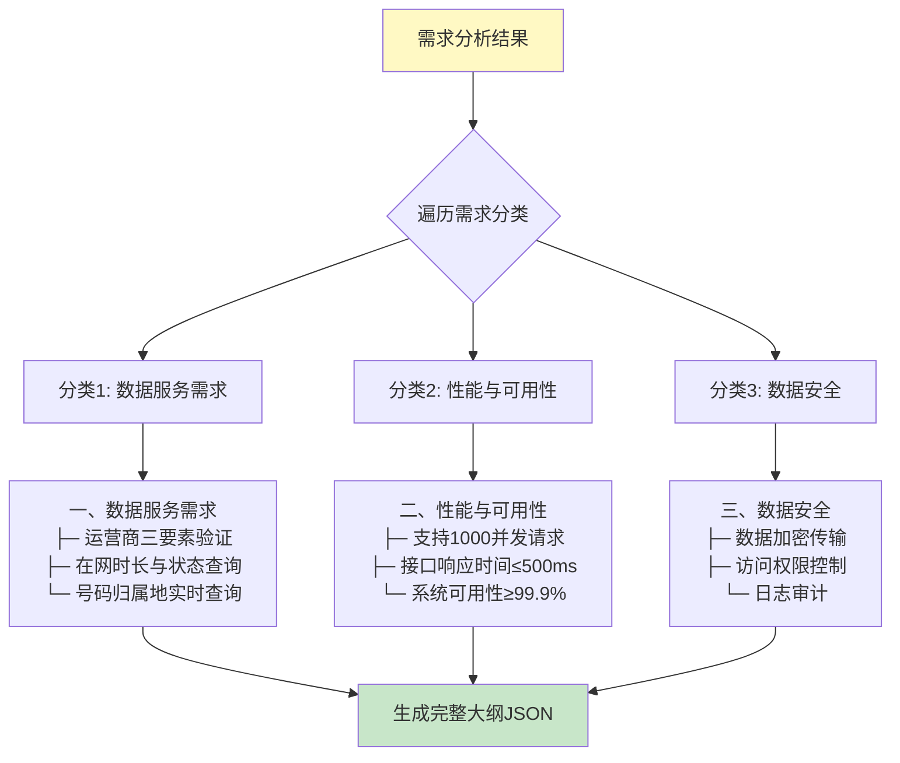
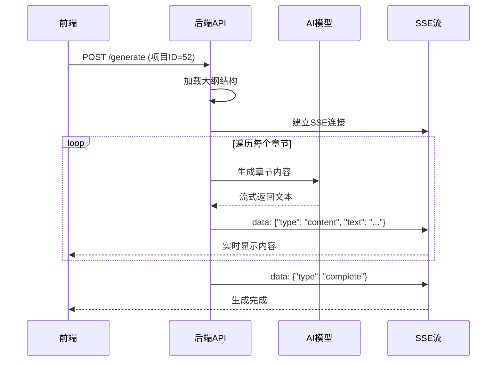
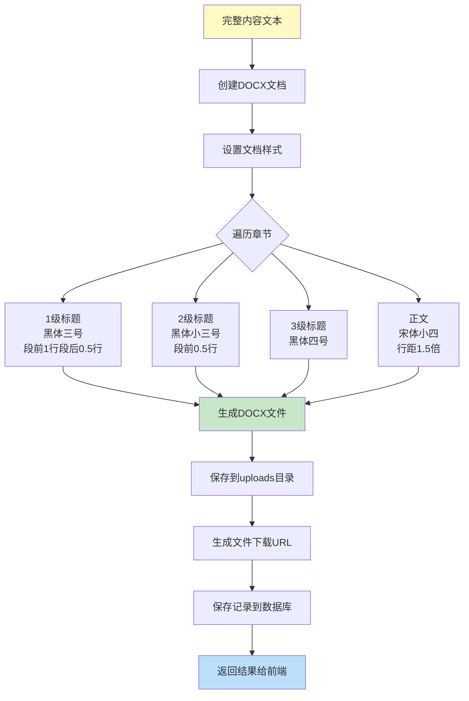
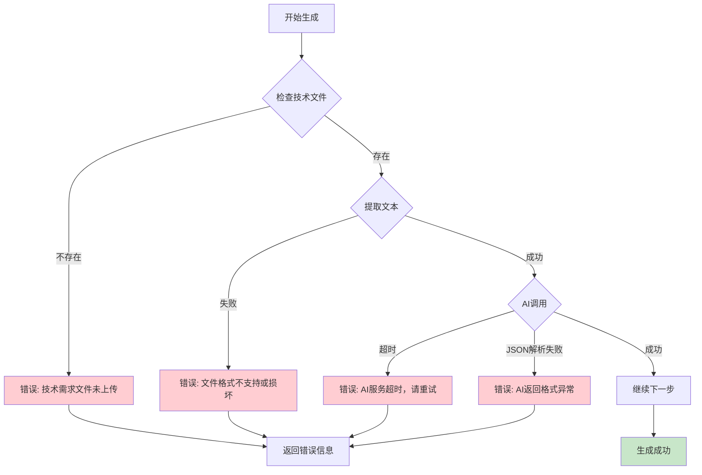
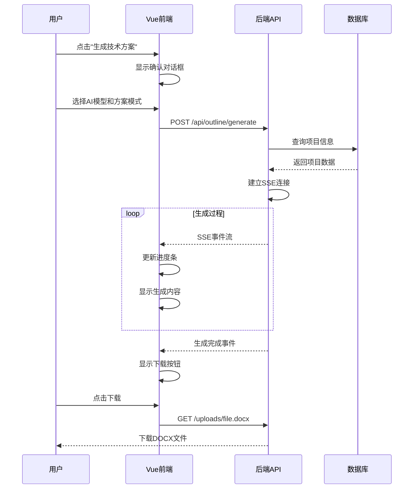

# 技术方案生成流程图

## 整体流程概览



## 详细步骤说明

### 📋 Step 0: 参数准备

```
输入参数:
├── project_id: 52                    # 项目ID
├── ai_model: shihuang-gpt4o-mini     # AI模型选择
├── solution_mode: advanced            # 方案模式 (standard/advanced)
└── stream: true                       # 是否使用SSE流式输出

加载项目信息:
├── 项目名称
├── 招标单位
├── 企业ID (company_id)
└── 技术需求文件路径
```

### 🔍 Step 1: 需求分析 (analyze_requirements)



**输出结果示例:**
```json
{
  "document_summary": {
    "total_requirements": 50,
    "mandatory_count": 30,
    "complexity_level": "high"
  },
  "requirement_categories": [
    {
      "category": "数据服务需求",
      "priority": "high",
      "keywords": ["三要素验证", "在网状态", "归属地查询"],
      "key_points": [
        "运营商三要素验证（★高优先级）",
        "在网时长与状态查询（▲需提供测试报告）",
        "号码归属地实时查询"
      ]
    }
  ]
}
```

### 📝 Step 2: 大纲生成 (generate_outline)



**章节编号规则:**
- 1级标题: 一、二、三、四、五...
- 2级标题: (一)、(二)、(三)、(四)、(五)...
- 3级标题: 1、2、3、4、5...

**输出结果示例:**
```json
{
  "outline_title": "XX项目技术方案应答大纲",
  "total_chapters": 3,
  "chapters": [
    {
      "level": 1,
      "title": "数据服务需求",
      "subsections": [
        {
          "level": 2,
          "title": "运营商三要素验证",
          "evidence_needed": ["运营商合作协议", "接口测试报告"]
        }
      ]
    }
  ]
}
```

### ✍️ Step 3: 内容填充 (SSE流式生成)



**流式输出事件类型:**
```javascript
// 1. 开始事件
data: {"type": "start", "message": "开始生成技术方案..."}

// 2. 进度事件
data: {"type": "progress", "current": 1, "total": 15, "section": "一、数据服务需求"}

// 3. 内容事件 (实时推送)
data: {"type": "content", "text": "本系统支持运营商三要素验证功能..."}

// 4. 章节完成事件
data: {"type": "section_complete", "section": "（一）运营商三要素验证"}

// 5. 完成事件
data: {"type": "complete", "output_files": {"docx": "path/to/file.docx"}}
```

### 📄 Step 4: 文档生成与保存



**文件存储结构:**
```
ai_tender_system/data/uploads/
└── technical_proposals/
    └── 2025/
        └── 12/
            └── 52/                              # 项目ID
                ├── tech_proposal_20251218_203045.docx
                ├── tech_proposal_20251218_203045.md
                └── outline_20251218_203045.json
```

## 🔑 关键数据结构

### 1. 项目信息
```python
{
    "project_id": 52,
    "project_name": "XX运营商数据服务平台",
    "bidding_unit": "某通信公司",
    "company_id": 1,
    "technical_file_path": "/path/to/tech_requirements.docx"
}
```

### 2. 需求分析结果
```python
{
    "document_summary": {
        "total_requirements": 50,
        "mandatory_count": 30,
        "optional_count": 15,
        "scoring_items": 5,
        "complexity_level": "high"
    },
    "requirement_categories": [
        {
            "category": "数据服务需求",
            "category_code": "data_service",
            "priority": "high",
            "requirements_count": 15,
            "keywords": ["三要素验证", "在网状态"],
            "key_points": [
                "运营商三要素验证（★高优先级）",
                "在网时长与状态查询（▲需提供测试报告）"
            ]
        }
    ]
}
```

### 3. 大纲结构
```python
{
    "outline_title": "XX项目技术方案应答大纲",
    "total_chapters": 4,
    "estimated_pages": 55,
    "chapters": [
        {
            "chapter_number": "1",
            "level": 1,
            "title": "数据服务需求",
            "priority": "high",
            "subsections": [
                {
                    "chapter_number": "1.1",
                    "level": 2,
                    "title": "运营商三要素验证",
                    "evidence_needed": ["运营商合作协议"],
                    "estimated_pages": 5
                }
            ]
        }
    ]
}
```

## 📊 性能指标

| 指标 | 标准模式 | 高级模式 |
|------|---------|---------|
| **需求分析** | 30-60秒 | 60-90秒 |
| **大纲生成** | 20-40秒 | 40-60秒 |
| **内容填充** | 3-5分钟 | 5-8分钟 |
| **总耗时** | 4-7分钟 | 7-10分钟 |
| **生成页数** | 30-50页 | 50-80页 |

## 🎯 关键特性

### 1. 动态需求分类 ✨
- ❌ 不再使用固定的5分类（功能性、非功能性、技术、实施、服务）
- ✅ 基于文档内容动态识别3-8个分类
- ✅ 使用行业特定术语（如"运营商数据服务"、"信创国产化"）

### 2. 灵活章节结构 📚
- ❌ 不再强制"总体设计 → 需求应答 → 技术指标 → 实施 → 服务"
- ✅ 根据需求分类动态生成章节
- ✅ 1级章节 = 需求分类名称
- ✅ 2级章节 = 具体需求点

### 3. 流式实时输出 ⚡
- ✅ SSE (Server-Sent Events) 技术
- ✅ 实时显示生成进度
- ✅ 内容逐字推送到前端
- ✅ 用户体验更好

### 4. 多模式支持 🎛️
- **standard**: 快速生成，内容简洁
- **advanced**: 深度分析，内容详尽

### 5. 智能文档匹配 🔍
- 自动从知识库匹配相关产品文档
- 推荐引用章节和截图
- 提供证明材料清单

## 🔄 错误处理流程



## 📱 前端交互流程



## 🛠️ 技术栈

| 层次 | 技术 | 用途 |
|------|------|------|
| **前端** | Vue 3 + TypeScript | 用户界面 |
| **前端通信** | EventSource API | SSE接收 |
| **后端** | Python Flask | API服务 |
| **AI模型** | shihuang-gpt4o-mini | 内容生成 |
| **文档生成** | python-docx | DOCX创建 |
| **文本提取** | python-docx, PyPDF2 | 文件解析 |
| **数据库** | SQLite | 数据存储 |
| **提示词** | JSON配置文件 | 模板管理 |

---

**生成时间**: 2025-12-18
**版本**: 2.0.0
**文件位置**: `/Users/lvhe/Downloads/zhongbiao/zhongbiao/技术方案生成流程图.md`
